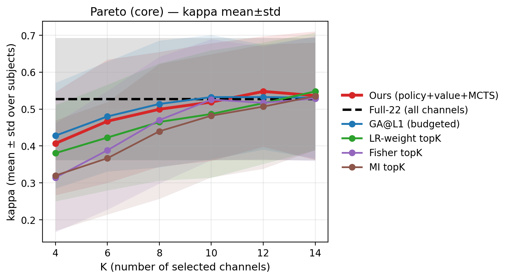
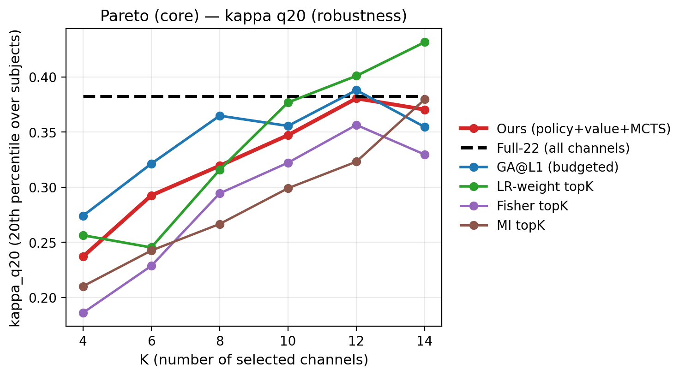
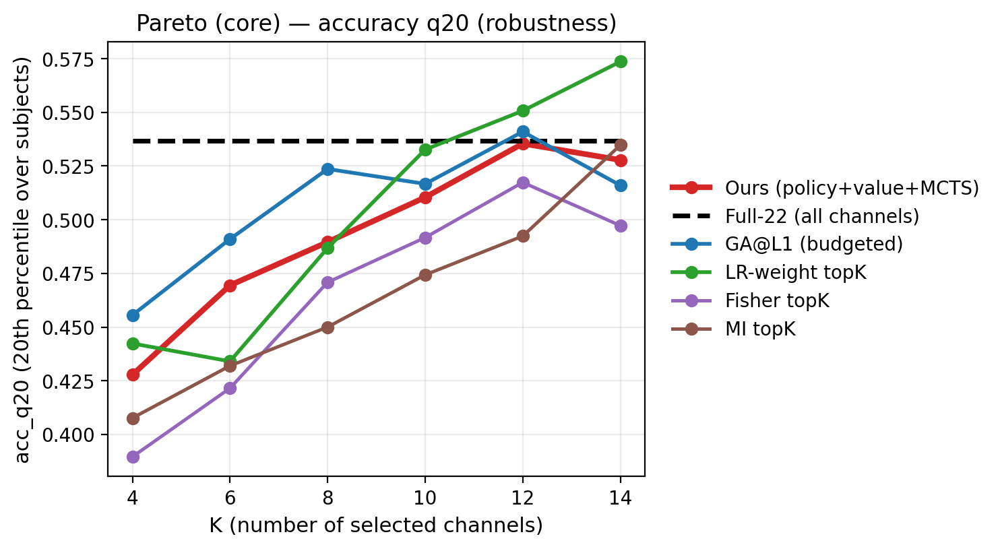
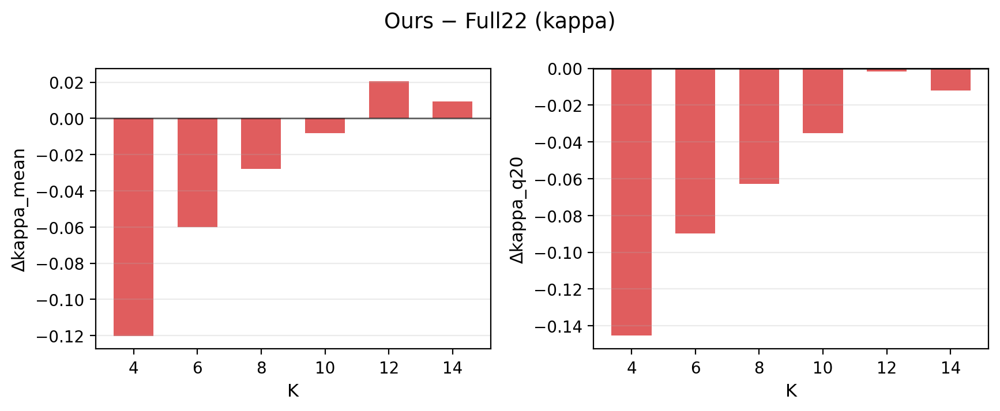
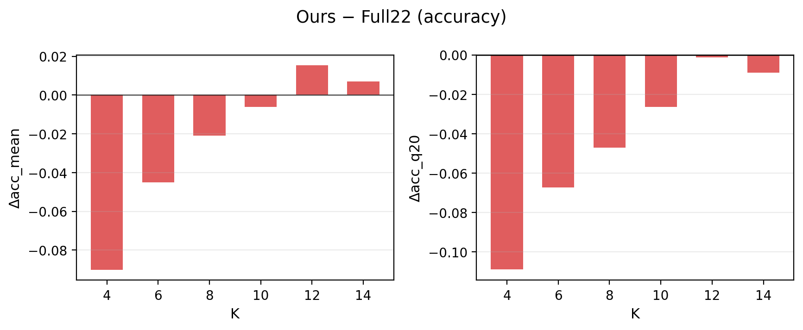
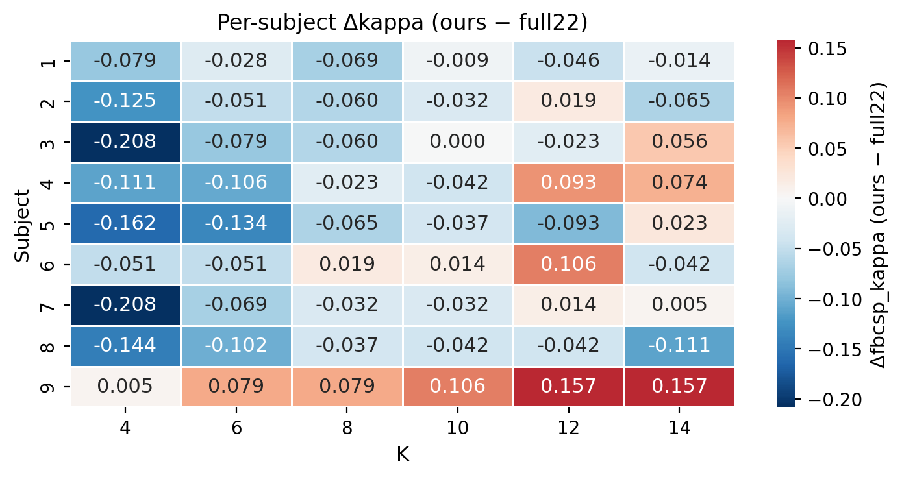
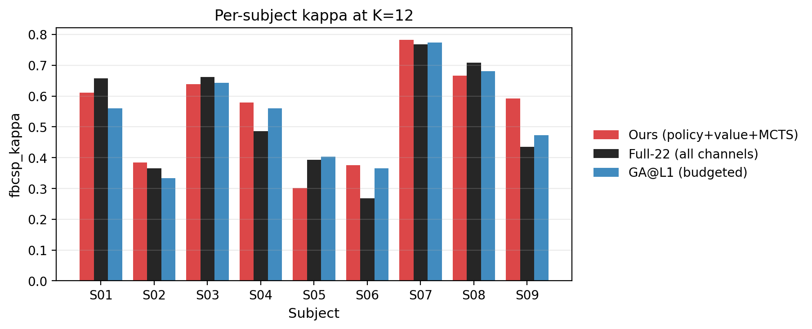
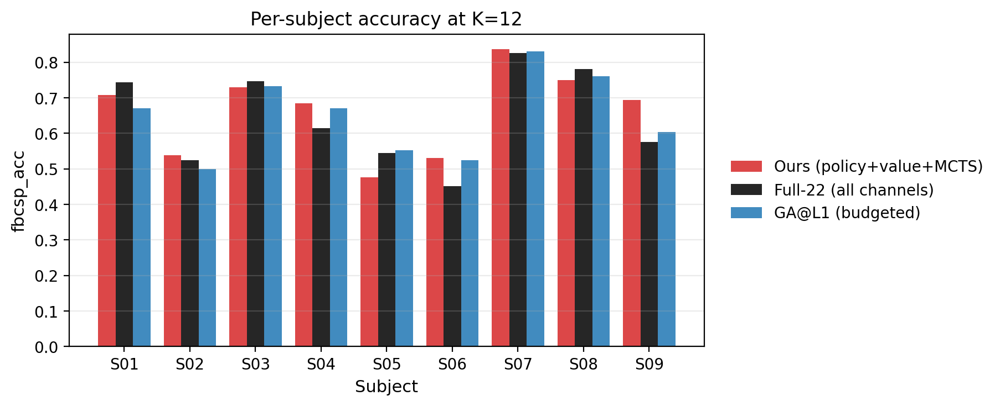
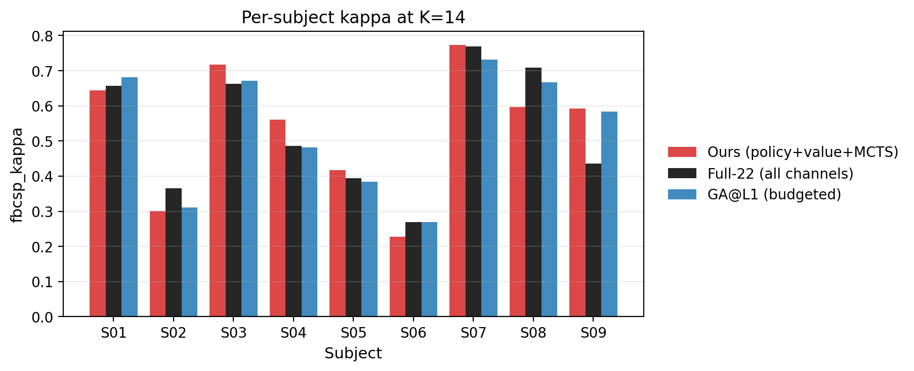
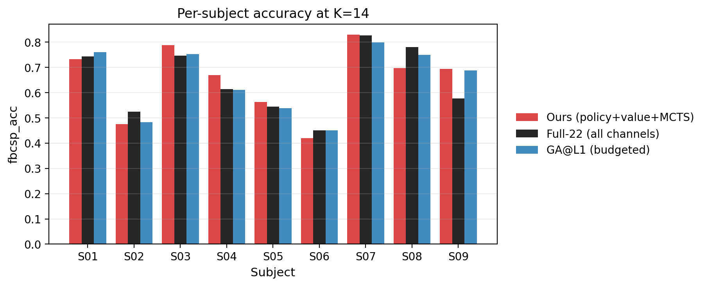

# 汇报文档（Post-mortem）— `agent_bd_teacher_fast_think2_q20` — `eval_best_nsim1024`

## 0) TL;DR（给老师先看）
- 本次 best checkpoint（`iter=437`）在 **K=12** 达到 **kappa_mean=0.5478（本次 K 网格最高）**，并在 K=12/14 的均值上略超 `full22`。
- 但 **尾部鲁棒性（`kappa_q20`）仍未稳定超过 `full22`**：个别被试出现回退，导致 q20 基本持平/略差。
- 小 K（4/6/8/10）明显落后 `full22`，且多数 K 下也落后 `ga_l1` → 典型“紧凑子集搜索不足 + 少数被试拖累”的失败形态。

## 1) 协议与可复现（严格 0train→1test）
- 数据集：`BNCI2014_001`（BCI-IV 2a，四分类 MI），subjects=`[1..9]`
- Variant：`f4-38_t2-6_eog0`（EOG 不作为分类输入；仅 EEG 通道参与分类）
- 评估：`MR-FBCSP`（training session 训练 → evaluation session 测试），指标：**Cohen’s kappa（主） + accuracy**
- Pareto 输出目录：`runs/agent_bd_teacher_fast_think2_q20/pareto/eval_best_nsim1024`
- 评估 checkpoint：`runs/agent_bd_teacher_fast_think2_q20/checkpoints/best.pt`（`iter=437`）
- 搜索预算：`mcts.n_sim=1024`，ours best-of-3 restart（详见 `runs/agent_bd_teacher_fast_think2_q20/pareto/eval_best_nsim1024/run_config.json`）
- baseline cache：`results/baseline_cache/f4-38_t2-6_eog0/pareto_fbcsp_ded45bb53113.csv`

> 关于 `q20`：对 9 个被试结果取 **20% 分位数**（更关注“较差被试”的鲁棒性；比均值更保守）。

## 2) 主结果（All subjects × 多 K）

### 2.1 每个 K 的赢家（kappa_mean / kappa_q20）
| K | best(kappa_mean) | value | runner-up | value | best(kappa_q20) | value |
| --- | --- | --- | --- | --- | --- | --- |
| 4 | full22 | 0.5273 | ga_l1 | 0.4280 | full22 | 0.3824 |
| 6 | full22 | 0.5273 | ga_l1 | 0.4799 | full22 | 0.3824 |
| 8 | full22 | 0.5273 | ga_l1 | 0.5139 | full22 | 0.3824 |
| 10 | ga_l1 | 0.5324 | full22 | 0.5273 | full22 | 0.3824 |
| 12 | ours | 0.5478 | ga_l1 | 0.5324 | lr_weight | 0.4009 |
| 14 | lr_weight | 0.5478 | ours | 0.5365 | lr_weight | 0.4315 |

### 2.2 Pareto 曲线（“核心方法”，减少图例混乱）







（附：全部方法曲线，用于 appendix）  
`figures/2026-01-04_agent_bd_teacher_fast_think2_q20_best_nsim1024/pareto_kappa_mean_all.png`

### 2.3 Ours 相对 Full22 的增益（Δ）




| k | kappa_mean_ours | kappa_mean_full22 | dkappa_mean | kappa_q20_ours | kappa_q20_full22 | dkappa_q20 | acc_mean_ours | acc_mean_full22 | dacc_mean |
| --- | --- | --- | --- | --- | --- | --- | --- | --- | --- |
| 4 | 0.4069 | 0.5273 | -0.1204 | 0.2370 | 0.3824 | -0.1454 | 0.5552 | 0.6454 | -0.0903 |
| 6 | 0.4671 | 0.5273 | -0.0602 | 0.2926 | 0.3824 | -0.0898 | 0.6003 | 0.6454 | -0.0451 |
| 8 | 0.4995 | 0.5273 | -0.0278 | 0.3194 | 0.3824 | -0.0630 | 0.6246 | 0.6454 | -0.0208 |
| 10 | 0.5190 | 0.5273 | -0.0082 | 0.3472 | 0.3824 | -0.0352 | 0.6393 | 0.6454 | -0.0062 |
| 12 | 0.5478 | 0.5273 | 0.0206 | 0.3806 | 0.3824 | -0.0019 | 0.6609 | 0.6454 | 0.0154 |
| 14 | 0.5365 | 0.5273 | 0.0093 | 0.3704 | 0.3824 | -0.0120 | 0.6524 | 0.6454 | 0.0069 |

## 3) 不同被试的对比（解释 q20 不提升）

### 3.1 Win-rate：ours 是否超过 full22（按被试数）
- K=4: 1/9；K=6: 1/9；K=8: 2/9；K=10: 2/9；K=12: 5/9；K=14: 5/9

### 3.2 Δkappa 热力图（ours − full22）



### 3.3 逐被试柱状图（K=12 与 K=14，含 GA@L1 对照）








### 3.4 具体到 K=12/14：改善集中在少数被试
- K=12（Δkappa=ours−full22）前三：S09 +0.1574，S06 +0.1065，S04 +0.0926；后三：S05 −0.0926，S01 −0.0463，S08 −0.0417
- K=14（Δkappa）前三：S09 +0.1574，S04 +0.0741，S03 +0.0556；后三：S08 −0.1111，S02 −0.0648，S06 −0.0417

> 这解释了为什么均值提升但 `q20` 没同步提升：`q20` 对“最差 1~2 个被试”的回退非常敏感。

## 4) 失败优先诊断（按 skill：failure-first + one-lever）
- **小 K 失败**：紧凑通道子集（K≤10）普遍落后 full22/GA，说明当前 reward/搜索先验仍偏“平均化”，不够偏向“少而强”的组合。
- **尾部风险**：K=12/14 均值略超 full22，但存在少数 subject 回退 → `q20` 不能提升。
- **强基线竞争**：大 K 时 `lr_weight` 在均值和尾部上更强，需要把“超过强基线”写进 reward（否则 RL 可能只学到“接近 full22”的区域）。

## 5) 下一步（控制变量：只动 reward 归一化）
- 当前正在训练的版本：`reward.normalize=adv_lrmax`（对每个 K 用 `max(full22, lr_weight@K)` 做 advantage），目标是把学习信号从“超过 full22”推向“超过强基线”。
- 待训练结束：复用相同 `mcts.n_sim=1024` 跑 Pareto，并生成同样的 per-subject 图，直接对比本报告的曲线形态是否改善（特别看：K≤10 的差距、以及 q20 是否上升）。

## 6) 复现命令（含：生成报告图）
评测（best checkpoint，nsim=1024）：
```bash
cd /home/wjx/workspace/RL/ALPHA

PYTHONPATH="$PWD/.vendor" \
MPLCONFIGDIR="$PWD/eeg_channel_game/data/mpl_cache" \
conda run -n rl --no-capture-output python3 -m eeg_channel_game.run_pareto_curve \
  --config eeg_channel_game/configs/exp/eval_pareto_agent_teacher_fast_think2_q20_last.yaml \
  --override project.device=cpu \
  --override mcts.n_sim=1024 \
  --checkpoint best \
  --tag eval_best_nsim1024 \
  --resume \
  --plot
```

生成本报告的“更清晰曲线 + per-subject 图”（不重新跑评估，只读 CSV 画图）：
```bash
cd /home/wjx/workspace/RL/ALPHA

PYTHONPATH="$PWD/.vendor" \
MPLCONFIGDIR="$PWD/eeg_channel_game/data/mpl_cache" \
python3 scripts/make_pareto_report.py \
  --pareto-dir runs/agent_bd_teacher_fast_think2_q20/pareto/eval_best_nsim1024 \
  --out-dir docs/reports/figures/2026-01-04_agent_bd_teacher_fast_think2_q20_best_nsim1024
```

