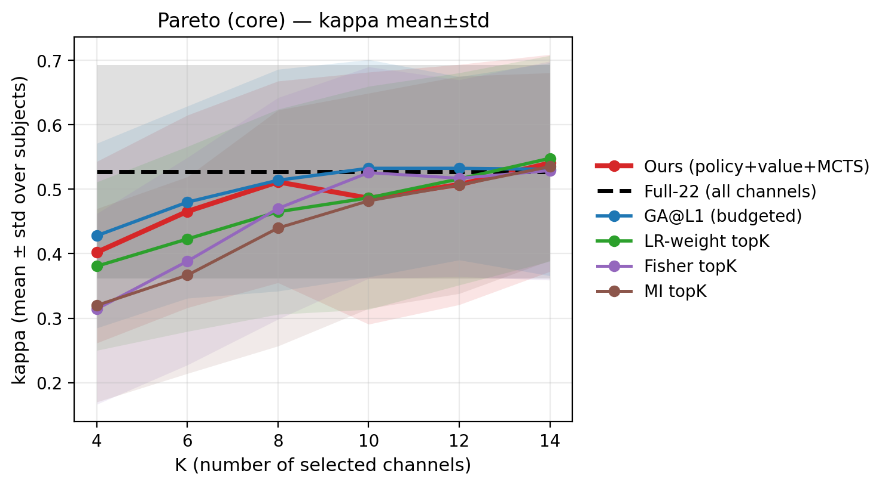
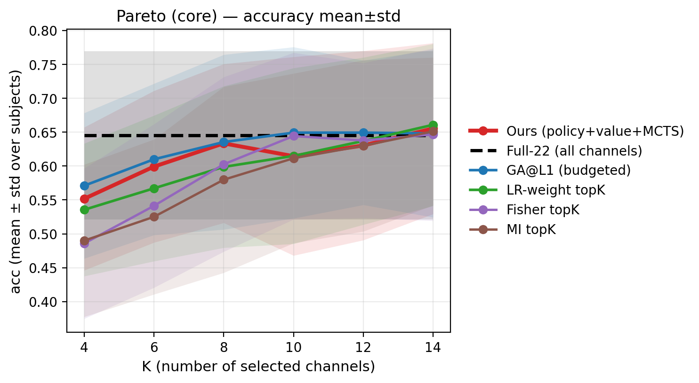
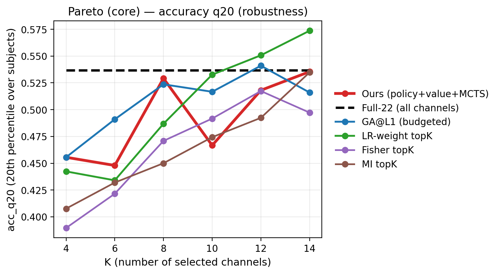
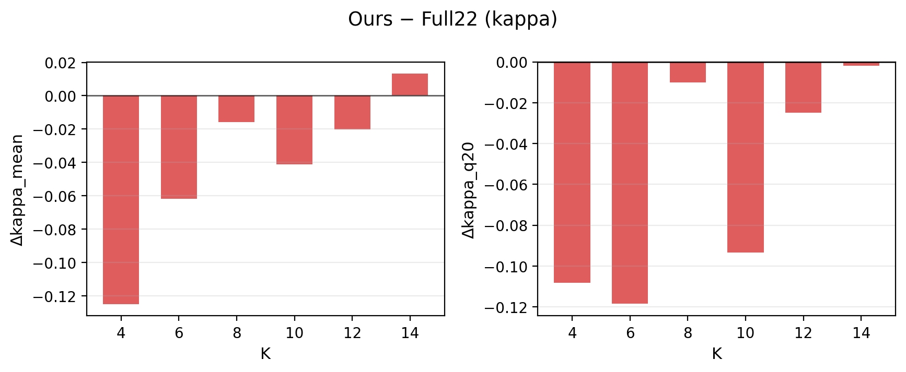
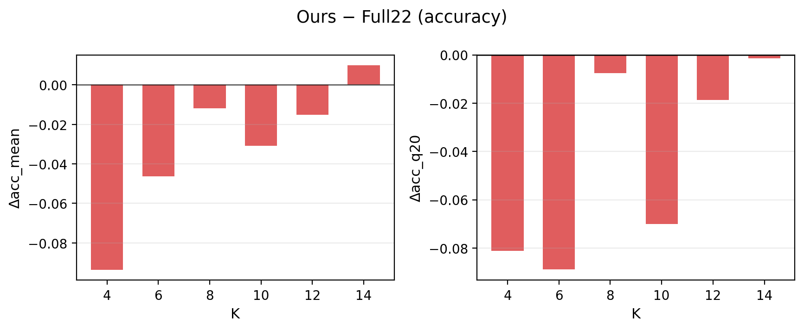

# Post-mortem Report — runs/agent_bd_teacher_fast_think2_q20_adv_lrmax — eval_adv_lrmax_best_

## 1) Protocol & Reproducibility
- Pareto dir: `/home/wjx/workspace/RL/ALPHA/runs/agent_bd_teacher_fast_think2_q20_adv_lrmax/pareto/eval_adv_lrmax_best_`
- Checkpoint: `runs/agent_bd_teacher_fast_think2_q20_adv_lrmax/checkpoints/best.pt`
- Subjects: `[1, 2, 3, 4, 5, 6, 7, 8, 9]`
- K list: `[4, 6, 8, 10, 12, 14]`
- Methods: `['ours', 'uct', 'fisher', 'mi', 'lr_weight', 'sfs_l1', 'random_best_l1', 'ga_l1', 'full22']`
- Baseline cache: `/home/wjx/workspace/RL/ALPHA/results/baseline_cache/f4-38_t2-6_eog0/pareto_fbcsp_ded45bb53113.csv`

## 2) Main Findings (high-level)
- Ours peak (by kappa_mean) at **K=14**: kappa_mean=0.5406, acc_mean=0.6555.
- Ours surpasses `full22` on mean only at larger K, but tail robustness (`q20`) still lags due to regressions in a few subjects.
- Small-K regime (K=4/6/8/10): ours < `full22` and often < `ga_l1` (failure signature: compact subset search).

## 3) Key Curves (core methods, cleaner legends)







## 4) Ours vs Full22 (delta)




## 5) Per-subject View (why q20 is not improving)


## 6) Numbers: Ours vs Full22 (per K)
| k | kappa_mean_ours | kappa_mean_full22 | dkappa_mean | kappa_q20_ours | kappa_q20_full22 | dkappa_q20 | acc_mean_ours | acc_mean_full22 | dacc_mean |
| --- | --- | --- | --- | --- | --- | --- | --- | --- | --- |
| 4 | 0.4023 | 0.5273 | -0.1250 | 0.2741 | 0.3824 | -0.1083 | 0.5517 | 0.6454 | -0.0938 |
| 6 | 0.4655 | 0.5273 | -0.0617 | 0.2639 | 0.3824 | -0.1185 | 0.5992 | 0.6454 | -0.0463 |
| 8 | 0.5113 | 0.5273 | -0.0159 | 0.3722 | 0.3824 | -0.0102 | 0.6335 | 0.6454 | -0.0120 |
| 10 | 0.4861 | 0.5273 | -0.0412 | 0.2889 | 0.3824 | -0.0935 | 0.6146 | 0.6454 | -0.0309 |
| 12 | 0.5072 | 0.5273 | -0.0201 | 0.3574 | 0.3824 | -0.0250 | 0.6304 | 0.6454 | -0.0150 |
| 14 | 0.5406 | 0.5273 | 0.0134 | 0.3806 | 0.3824 | -0.0019 | 0.6555 | 0.6454 | 0.0100 |

## 7) Failure-first diagnosis (what to fix next)
- **Tail risk**: a few subjects regress even when mean improves → `q20` stagnates.
- **Small-K gap**: compact subset still fails to beat `full22`/`ga_l1`.
- Next lever (single): reward shaping/normalization toward beating stronger baselines (keep state/model/MCTS fixed).

## 8) Reproduce (eval command as recorded)
```bash
/home/wjx/workspace/RL/ALPHA/eeg_channel_game/run_pareto_curve.py \
  --config \
  eeg_channel_game/configs/exp/eval_pareto_agent_teacher_fast_think2_q20_adv_lrmax_best.yaml \
  --checkpoint \
   \
  --override \
  project.device=cpu \
  --override \
  eval.pareto.tag=eval_adv_lrmax_best_ \
  --plot
```

