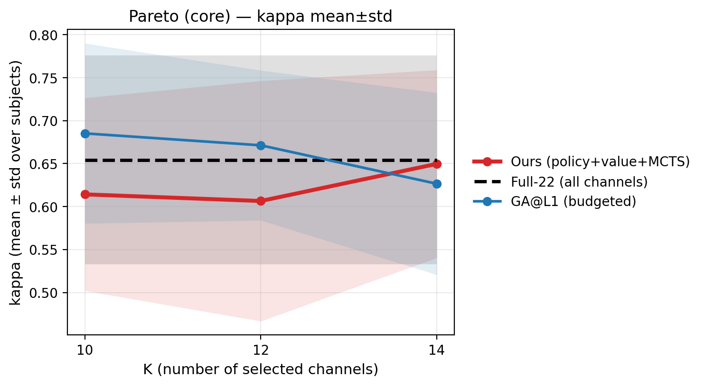
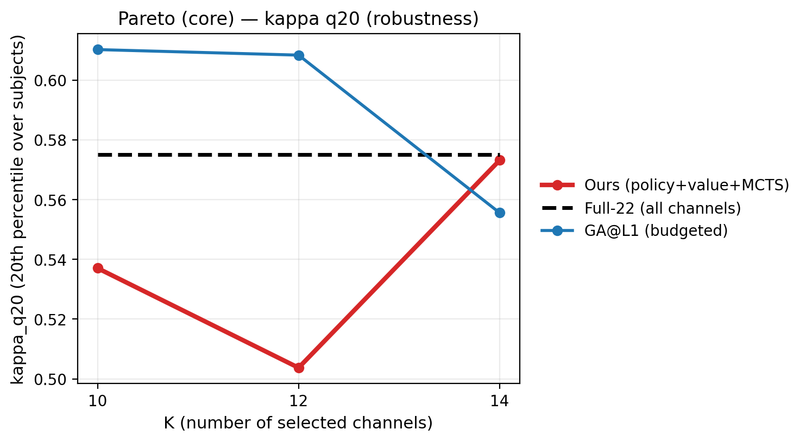
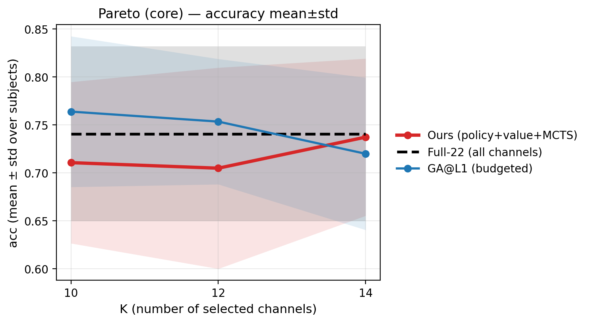
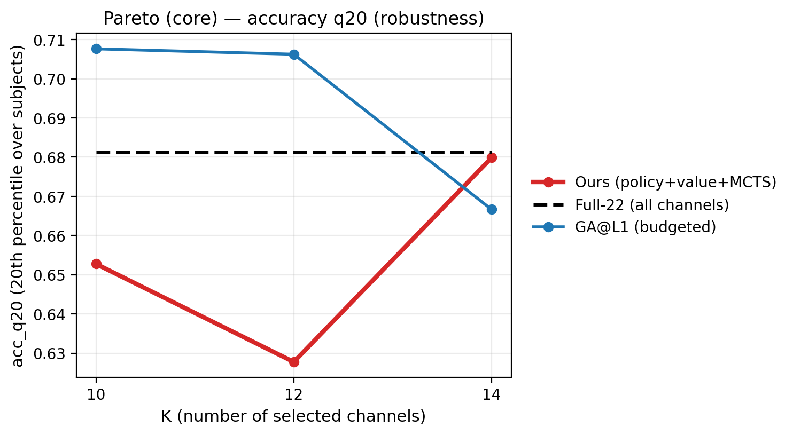
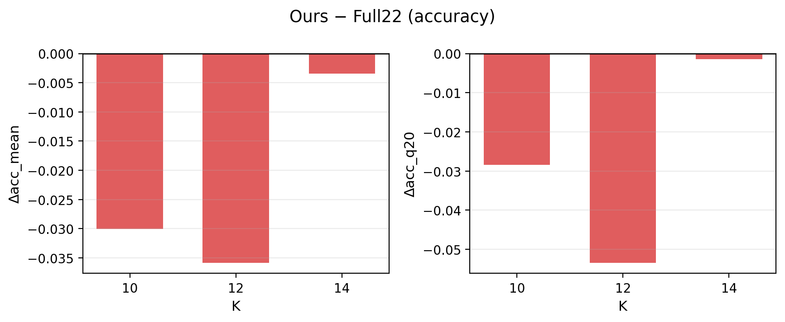
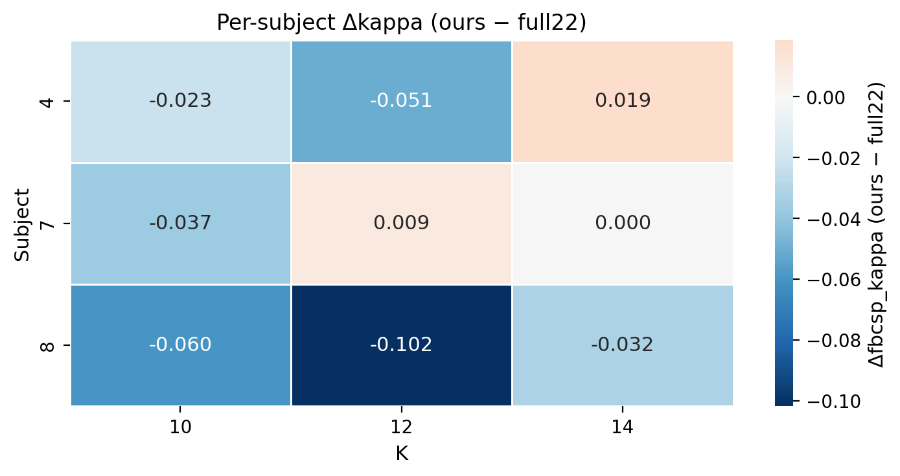
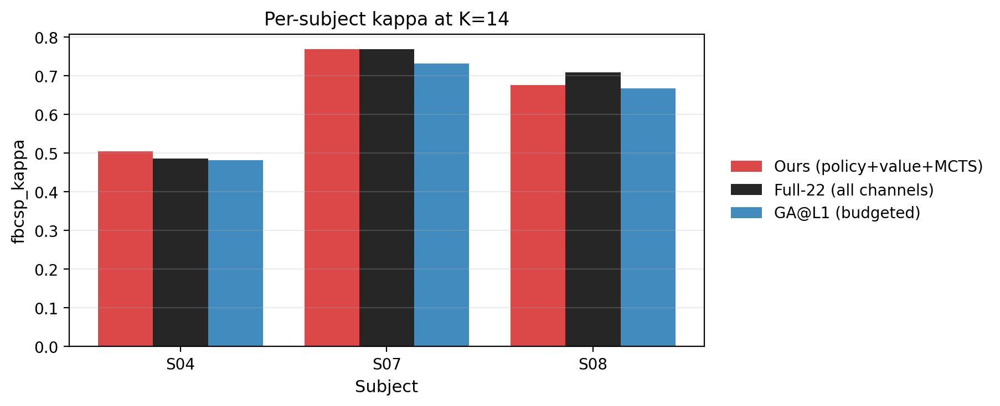

# Post-mortem Report — runs/agent_bd_teacher_fast_think2_q20_adv_lrmax — eval_adv_lrmax_last_iter320_stochR10_hard

## 1) Protocol & Reproducibility
- Pareto dir: `/home/wjx/workspace/RL/ALPHA/runs/agent_bd_teacher_fast_think2_q20_adv_lrmax/pareto/eval_adv_lrmax_last_iter320_stochR10_hard`
- Checkpoint: `runs/agent_bd_teacher_fast_think2_q20_adv_lrmax/checkpoints/last.pt`
- Subjects: `[4, 7, 8]`
- K list: `[10, 12, 14]`
- Methods: `['ours', 'ga_l1', 'random_best_l1', 'full22']`
- Baseline cache: `/home/wjx/workspace/RL/ALPHA/results/baseline_cache/f4-38_t2-6_eog0/pareto_fbcsp_ded45bb53113.csv`

## 2) Main Findings (high-level)
- Ours peak (by kappa_mean) at **K=14**: kappa_mean=0.6497, acc_mean=0.7373.
- Ours surpasses `full22` on mean only at larger K, but tail robustness (`q20`) still lags due to regressions in a few subjects.
- Small-K regime (K=4/6/8/10): ours < `full22` and often < `ga_l1` (failure signature: compact subset search).

## 3) Key Curves (core methods, cleaner legends)








## 4) Ours vs Full22 (delta)




## 5) Per-subject View (why q20 is not improving)




## 6) Numbers: Ours vs Full22 (per K)
| k | kappa_mean_ours | kappa_mean_full22 | dkappa_mean | kappa_q20_ours | kappa_q20_full22 | dkappa_q20 | acc_mean_ours | acc_mean_full22 | dacc_mean |
| --- | --- | --- | --- | --- | --- | --- | --- | --- | --- |
| 10 | 0.6142 | 0.6543 | -0.0401 | 0.5370 | 0.5750 | -0.0380 | 0.7106 | 0.7407 | -0.0301 |
| 12 | 0.6065 | 0.6543 | -0.0478 | 0.5037 | 0.5750 | -0.0713 | 0.7049 | 0.7407 | -0.0359 |
| 14 | 0.6497 | 0.6543 | -0.0046 | 0.5731 | 0.5750 | -0.0019 | 0.7373 | 0.7407 | -0.0035 |

## 7) Failure-first diagnosis (what to fix next)
- **Tail risk**: a few subjects regress even when mean improves → `q20` stagnates.
- **Small-K gap**: compact subset still fails to beat `full22`/`ga_l1`.
- Next lever (single): reward shaping/normalization toward beating stronger baselines (keep state/model/MCTS fixed).

## 8) Reproduce (eval command as recorded)
```bash
/home/wjx/workspace/RL/ALPHA/eeg_channel_game/run_pareto_curve.py \
  --config \
  eeg_channel_game/configs/exp/eval_pareto_agent_teacher_fast_think2_q20_adv_lrmax_last.yaml \
  --override \
  project.device=cpu \
  --override \
  eval.pareto.tag=eval_adv_lrmax_last_iter320_stochR10_hard \
  --subjects \
  4,7,8 \
  --k \
  10,12,14 \
  --methods \
  ours,ga_l1,random_best_l1,full22 \
  --ours-restarts \
  10 \
  --ours-stochastic \
  --ours-tau \
  0.8 \
  --override \
  mcts.n_sim=1024 \
  --plot
```

