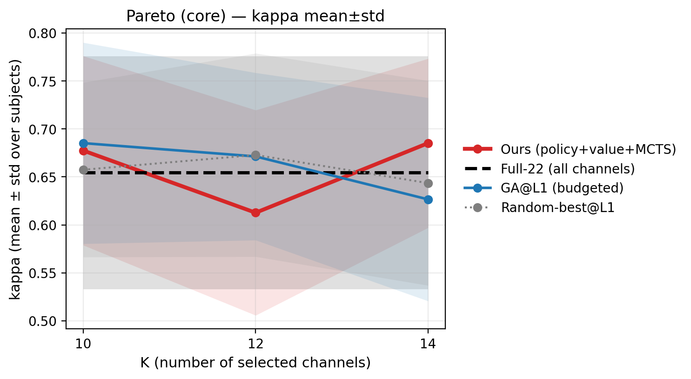
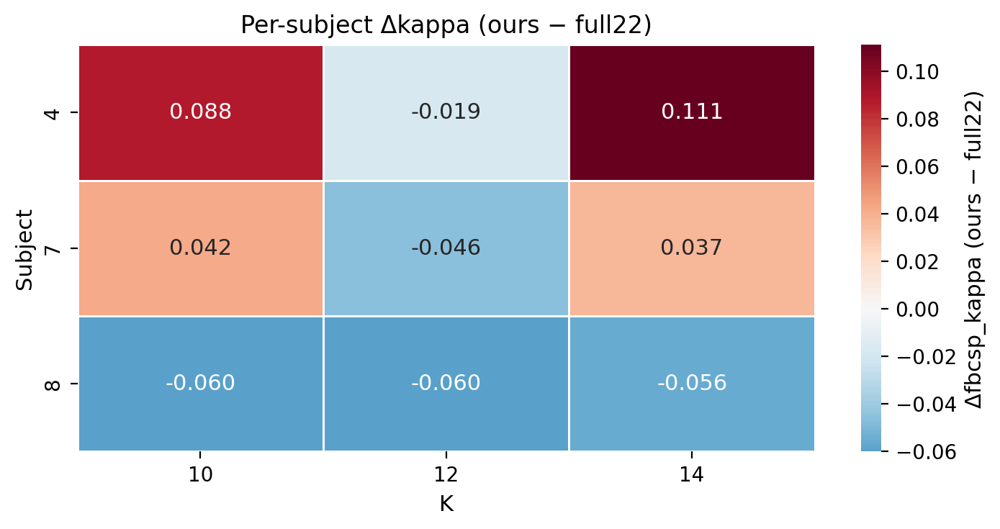
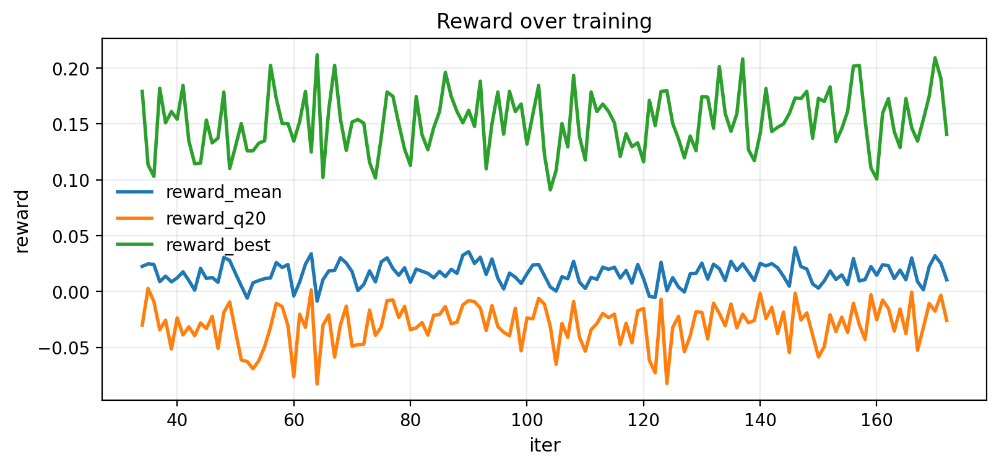
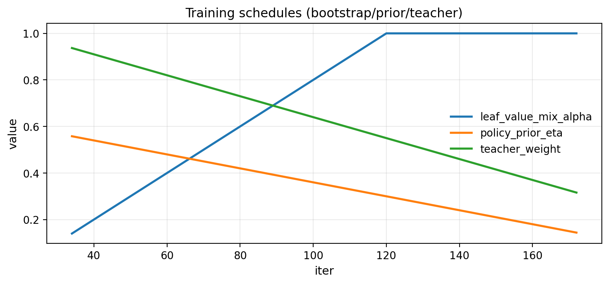
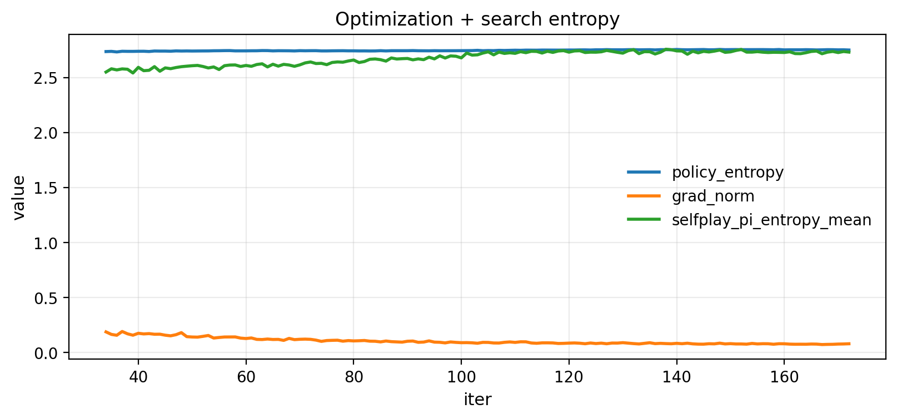

# 阶段性实验报告（可汇报版）— 从扩大搜索到定位训练异常（截至 2026-01-11）

> 目的：把“从发现评测异常 → 通过扩大搜索验证假设 → 扩展到全被试 → 新一轮训练中定位到关键异常并给出下一步方案”的证据链整理成一份可直接发老师的文档。  
> 协议约束：**0train 训练/选择**，**1test 仅最终报告**；EOG **不作为分类输入**（只允许用于伪迹惩罚/风险估计）。

---

## 0) 项目与指标（统一口径）

**数据集/协议**
- 数据集：BCI-IV 2a / BNCI2014_001（4 分类 MI）
- 评测范式：`0train -> 1eval`（训练 session 只用于训练与通道选择；评测 session 只用于最终 kappa/acc 报告）

**主指标**
- Cohen’s kappa（主指标）+ accuracy（同时报告）
- `kappa_q20`：对“被试维度”的 **20%分位数（tail robustness）**；用于衡量“少数困难被试”是否稳定提升（不是论文常规主指标，但用于本项目的风险敏感诊断/对齐 reward 设计）。

---

## 1) 事件起点：扩大搜索（3 被试 × 3K）发现“评测对搜索预算敏感”

### 1.1 实验设置（固定变量，先查搜索不足）
我们先固定 **同一个模型（同一个 run / 同一类 reward）**，只改变“搜索方式/预算”，验证性能波动是否主要来自搜索不充分。

**Run（训练产物）**
- run：`runs/agent_bd_teacher_fast_think2_q20_adv_lrmax`
- 训练 reward：`adv_lrmax`（相对 `max(full22, lr_weight_topK(K))` 的 advantage 归一化；见 `eeg_channel_game/eval/evaluator_normalize.py`）

**扩大搜索（evaluation-time）**
- `--ours-stochastic --ours-tau 0.8 --ours-restarts 10`（best-of-10 multi-start；只按 0train reward 选最优，不看 1eval）
- `mcts.n_sim=1024`（对齐当前主评测预算）

### 1.2 对照 1：last@iter320（3 被试 × 3K）
- 评测目录：`runs/agent_bd_teacher_fast_think2_q20_adv_lrmax/pareto/eval_adv_lrmax_last_iter320_stochR10_hard`
- 对应汇报（含图与表）：`docs/reports/2026-01-08_postmortem_agent_bd_teacher_fast_think2_q20_adv_lrmax_last_iter320_stochR10_hard.md`

该对照显示：在 `K=10/12` 时 **ours 明显落后 full22 / GA**，`K=14` 才接近（但 q20 仍不稳）。

### 1.3 对照 2：best（同样 3 被试 × 3K）
- 评测目录：`runs/agent_bd_teacher_fast_think2_q20_adv_lrmax/pareto/eval_adv_lrmax_best_stochR10_hard`
- 本次新增的“更干净图表”（core methods + delta + heatmap）：`docs/reports/figures/2026-01-11_agent_bd_teacher_fast_think2_q20_adv_lrmax_best_stochR10_hard/`

核心对比图（best, 3 被试 × 3K）：





### 1.4 关键结论（证据：last vs best，同预算搜索）
同样是 **stochastic + restarts=10 + n_sim=1024**，`best.pt` 相比 `last.pt` 在 3 被试×3K 上有明显变化（部分 K 大幅提升，也存在个别 K 下滑），说明：

1) **“评测结果差”不一定是 reward 设计本身失败**，也可能是 checkpoint 质量差异或搜索 budget 不足导致；  
2) 评测必须把“搜索预算”固定好，否则很难归因模型好坏。

下面表格把 3 被试×3K 的 last vs best 直接并排（kappa/acc 都列出；full22/GA/random_best 是同一缓存基线）：

| subject | k | last_ours_kappa | best_ours_kappa | d_kappa_best_minus_last | best_full22_kappa | best_ga_l1_kappa | best_random_best_l1_kappa | d_kappa_best_minus_full22 | last_ours_acc | best_ours_acc | d_acc_best_minus_last | best_full22_acc | best_ga_l1_acc | best_random_best_l1_acc | d_acc_best_minus_full22 |
| --- | --- | --- | --- | --- | --- | --- | --- | --- | --- | --- | --- | --- | --- | --- | --- |
| 4.0 | 10.0 | 0.463 | 0.5741 | 0.1111 | 0.4861 | 0.6065 | 0.5509 | 0.088 | 0.5972 | 0.6806 | 0.0833 | 0.6146 | 0.7049 | 0.6632 | 0.066 |
| 4.0 | 12.0 | 0.4352 | 0.4676 | 0.0324 | 0.4861 | 0.5602 | 0.5463 | -0.0185 | 0.5764 | 0.6007 | 0.0243 | 0.6146 | 0.6701 | 0.6597 | -0.0139 |
| 4.0 | 14.0 | 0.5046 | 0.5972 | 0.0926 | 0.4861 | 0.4815 | 0.5231 | 0.1111 | 0.6285 | 0.6979 | 0.0694 | 0.6146 | 0.6111 | 0.6424 | 0.0833 |
| 7.0 | 10.0 | 0.7315 | 0.8102 | 0.0787 | 0.7685 | 0.8333 | 0.7731 | 0.0417 | 0.7986 | 0.8576 | 0.059 | 0.8264 | 0.875 | 0.8299 | 0.0312 |
| 7.0 | 12.0 | 0.7778 | 0.7222 | -0.0556 | 0.7685 | 0.7731 | 0.8056 | -0.0463 | 0.8333 | 0.7917 | -0.0417 | 0.8264 | 0.8299 | 0.8542 | -0.0347 |
| 7.0 | 14.0 | 0.7685 | 0.8056 | 0.037 | 0.7685 | 0.7315 | 0.7824 | 0.037 | 0.8264 | 0.8542 | 0.0278 | 0.8264 | 0.7986 | 0.8368 | 0.0278 |
| 8.0 | 10.0 | 0.6481 | 0.6481 | 0.0 | 0.7083 | 0.6157 | 0.6481 | -0.0602 | 0.7361 | 0.7361 | 0.0 | 0.7812 | 0.7118 | 0.7361 | -0.0451 |
| 8.0 | 12.0 | 0.6065 | 0.6481 | 0.0417 | 0.7083 | 0.6806 | 0.6667 | -0.0602 | 0.7049 | 0.7361 | 0.0312 | 0.7812 | 0.7604 | 0.75 | -0.0451 |
| 8.0 | 14.0 | 0.6759 | 0.6528 | -0.0231 | 0.7083 | 0.6667 | 0.625 | -0.0556 | 0.7569 | 0.7396 | -0.0174 | 0.7812 | 0.75 | 0.7188 | -0.0417 |

按 K 对 3 个被试取平均（便于看“整体趋势”）：

| k | last_ours_kappa | best_ours_kappa | d_kappa_best_minus_last | best_full22_kappa | d_kappa_best_minus_full22 | last_ours_acc | best_ours_acc | d_acc_best_minus_last | best_full22_acc | d_acc_best_minus_full22 |
| --- | --- | --- | --- | --- | --- | --- | --- | --- | --- | --- |
| 10.0 | 0.6142 | 0.6775 | 0.0633 | 0.6543 | 0.0232 | 0.7106 | 0.7581 | 0.0474 | 0.7407 | 0.0174 |
| 12.0 | 0.6065 | 0.6126 | 0.0062 | 0.6543 | -0.0417 | 0.7049 | 0.7095 | 0.0046 | 0.7407 | -0.0312 |
| 14.0 | 0.6497 | 0.6852 | 0.0355 | 0.6543 | 0.0308 | 0.7373 | 0.7639 | 0.0266 | 0.7407 | 0.0231 |

**阶段结论**
- 3 被试×3K 下：`best` 相比 `last@iter320` 在 `K=10/14` 明显更好（但 `K=12` 不稳定）。  
- 这支持“搜索预算/搜索随机性 + checkpoint 选择”是强影响因素：**不能仅凭一次 deterministic/少 restart 的评测下结论**。

---

## 2) 扩展到全被试：把“扩大搜索”固化为评测默认

把“扩大搜索”固定为评测默认（stochastic + restarts=10，加入黎曼基线以补齐相关工作常见 baseline）：
- 对应汇报（best）：`docs/reports/2026-01-08_postmortem_agent_bd_teacher_fast_think2_q20_adv_lrmax_best_stochR10_all9_riemann.md`
- 对应汇报（last）：`docs/reports/2026-01-09_postmortem_agent_bd_teacher_fast_think2_q20_adv_lrmax_last_stochR10_all9_riemann.md`

示例关键图（best, all9）：


**阶段结论（all9）**
- 在大 K（尤其 `K=14`）时，ours 可以在 mean 上超过 full22（且部分设置下 q20 也能转正）；  
- 但小 K（4/6/8）长期落后，且 q20 仍是系统性短板 → 这也是后续训练/奖励/表示学习需要重点解决的方向。

---

## 3) 新一轮训练（ds_eta0p2）：在训练过程中定位“关键异常/风险”

### 3.1 训练设置与进度快照
**Run**
- `runs/agent_bd_teacher_fast_think2_q20_adv_lrmax_ds_eta0p2`

**一处单杠杆改动（控制变量）**
- 仅增强 domain shift penalty：`reward.domain_shift.eta = 0.2`（其余继承 `train_agent_teacher_fast_think2_q20_adv_lrmax.yaml`）
- 配置：`eeg_channel_game/configs/exp/train_agent_teacher_fast_think2_q20_adv_lrmax_ds_eta0p2.yaml`

**训练诊断日志（本次新增，便于定位问题）**
- 训练统计：`runs/.../train_metrics.csv`（每 iter 记录 reward 分布、搜索行为、loss、日程变量等）
- 超参快照：`runs/.../hparams.json`

我们对 `train_metrics.csv` 做了“leaf bootstrap 退场前后”对比（关键点：`leaf_value_mix_alpha` 从 <1 走到 1，完全依赖网络 value，不再混 proxy）。

### 3.2 关键异常（现阶段已可观测，不必等到 400 iter 才能发现）
**异常 A：tail risk 持续存在**
- 最近窗口中 `reward_q20` 长期为负（代表 bottom 20% episode 仍明显输 baseline_max），而 `reward_best` 很高 → **方差大 + 鲁棒性差**。

**异常 B：leaf bootstrap 完全退场后，策略/搜索熵上升但收益不升**
- `leaf_value_mix_alpha≈1.0` 从 iter=120 开始（由 warmup 计划决定），此后：
  - `pi_entropy_mean` 与 `train_policy_entropy` 均上升（搜索/策略更接近均匀、决策不够“尖锐”）
  - `reward_mean` 没有系统性变好，`reward_q20` 也没有改善

用 iter=120 作为分界，取窗口对比（每窗口 30 iters）：
- **pre（90–119）**：`pi_entropy_mean ≈ 2.7099`，`train_policy_entropy ≈ 2.7471`  
- **post（120–149）**：`pi_entropy_mean ≈ 2.7363`，`train_policy_entropy ≈ 2.7536`  
同时 `reward_q20` 仍≈ -0.029 量级（未改善）。

这更像是：**网络 value/policy 尚未强到能“接住” proxy 退场后的 MCTS**，导致搜索更发散（熵更高），但优势没有扩大。

对应训练曲线图（来自 `train_metrics.csv`）：







### 3.3 为什么建议等到 iter≈220 再下最终结论
当前配置中（见 `hparams.json` / 训练日志）：
- `teacher_kl` 与 `policy_prior` 都是 `start_iter=20, warmup_iters=200`  
→ 到 **iter≈220** 才完成衰减/退火过程。  
因此：在 iter≈120–170 期间观察到的异常，很可能仍处于“启发式强约束 + 网络未完全接管”的过渡阶段。

**结论**：现在就能定位风险（tail risk + 熵上升/收益不升），但是否需要立即停训/大改，建议至少等到 iter≈220 再决策。

---

## 4) 下一步方案（单杠杆候选，等 iter≈220 做决策）

> 目标：改善 q20（鲁棒性）与小 K 性能，同时避免“proxy 退场后策略发散”。

候选方案（按“单杠杆”原则排序）：

1) **延长/改变 leaf bootstrap 日程（优先）**  
   - 让 `leaf_value_mix_alpha` 更久地 <1（或让 `alpha_end<1`），避免网络在未成熟时独自承担 value 估计。  
   - 预期：`pi_entropy_mean` 下降、`reward_q20` 上升、评测更稳定。

2) **把 checkpoint 选择从 mean_reward 改为更稳健指标（如 reward_q20）**  
   - 当前 `best.pt` 默认追踪 mean_reward（见训练日志与 checkpoint 字段），可能会偏向“均值高但尾部差”的策略。  
   - 预期：使最终用于评测的 best 更贴近论文目标（鲁棒/少数被试不崩）。

3) （下一轮再做）**小 K 专项**：固定 K（或分段 K）训练/评测，减少 multi-K 同时学导致的冲突。  

---

## 5) 复现实验入口（关键命令）

**3 被试 × 3K 扩大搜索（best）**
```bash
PYTHONPATH="$PWD/.vendor" MPLCONFIGDIR="$PWD/eeg_channel_game/data/mpl_cache" \
conda run -n rl --no-capture-output python3 -m eeg_channel_game.run_pareto_curve \
  --config eeg_channel_game/configs/exp/eval_pareto_agent_teacher_fast_think2_q20_adv_lrmax_best.yaml \
  --override project.device=cpu \
  --override mcts.n_sim=1024 \
  --tag eval_adv_lrmax_best_stochR10_hard \
  --subjects 4,7,8 \
  --k 10,12,14 \
  --methods ours,ga_l1,random_best_l1,full22 \
  --ours-stochastic --ours-tau 0.8 --ours-restarts 10 \
  --plot
```

**ds_eta0p2 训练**
```bash
PYTHONPATH="$PWD/.vendor" MPLCONFIGDIR="$PWD/eeg_channel_game/data/mpl_cache" \
conda run -n rl --no-capture-output python3 -m eeg_channel_game.run_train \
  --config eeg_channel_game/configs/exp/train_agent_teacher_fast_think2_q20_adv_lrmax_ds_eta0p2.yaml \
  --override project.device=cpu
```

---

## 6) 小结（可用于老师面前 30 秒复述）
- 通过 3 被试×3K 的“扩大搜索”对照实验，确认评测对搜索预算与 checkpoint 高度敏感；用 stochastic + 多 restart 后，部分 K 上 ours 可超过 full22（尤其大 K）。  
- 全被试扩展后，主要短板仍是 **小 K** 与 **tail robustness（q20）**。  
- 新一轮 ds_eta0p2 训练中，已在训练日志里定位到“leaf bootstrap 退场后熵上升但收益不升”的异常信号；但由于 teacher/prior 退火未结束，建议等到 iter≈220 再下最终结论，并优先考虑“延长 leaf bootstrap 日程”作为下一轮单杠杆改动。

