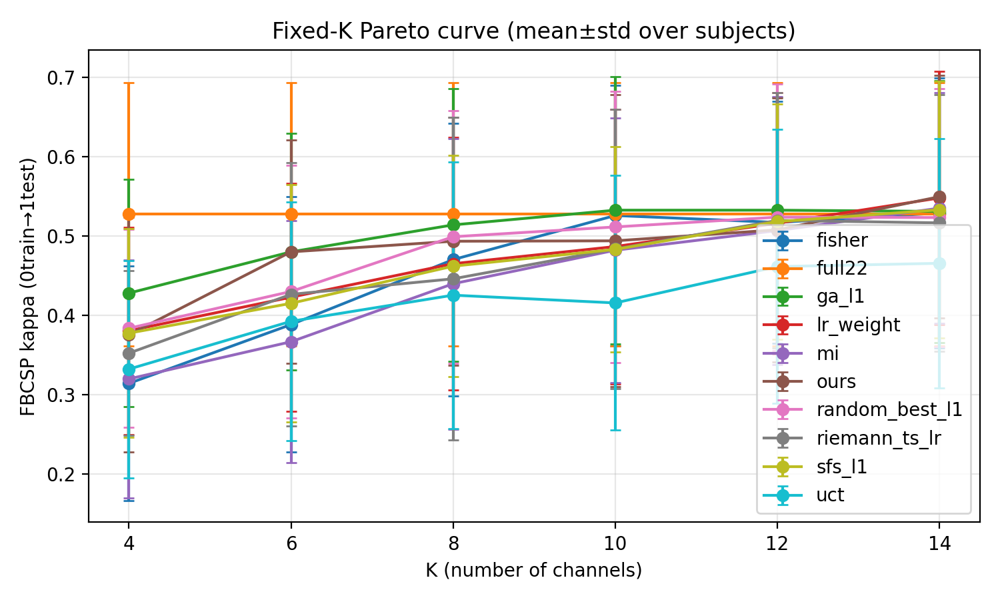
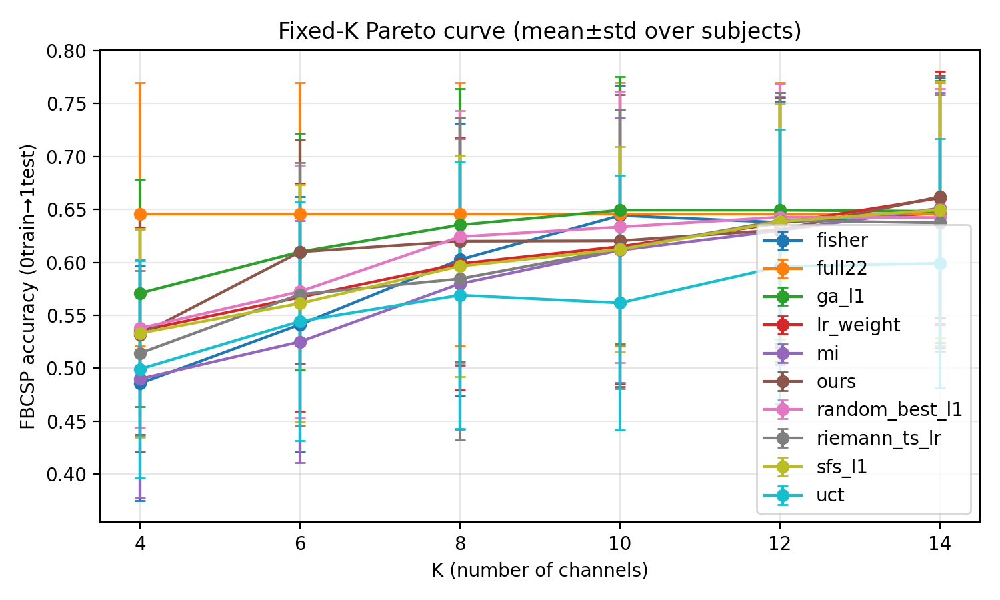

# Post-mortem — EEG-only + Arena Gate — Pareto (all 9 subjects, stochastic restarts) — 2026-01-15

## 1) Setting (main-result protocol)
- Dataset: BNCI2014_001 (BCI-IV 2a), 4-class MI, subjects=1–9
- Protocol: **0train used for training & selection; 1test labels only for reporting**
- Main-result constraint: **pure EEG** (`include_eog=false`, `use_eog_regression=false`)
- Evaluator: L1 FBCSP (`robust_mode=q20`) + reward normalization `adv_lrmax`
- Metrics: Cohen’s kappa + accuracy (report mean across subjects)

## 2) What was evaluated
**Run**
- `runs/agent_bd_teacher_fast_think2_q20_adv_lrmax_eegonly_arena`

**Pareto eval output**
- `runs/agent_bd_teacher_fast_think2_q20_adv_lrmax_eegonly_arena/pareto/eval_eegonly_arena_best_stochR10_all9_riemann`

**Search budget (ours)**
- `mcts.n_sim=1024`
- `--ours-stochastic --ours-tau 0.8 --ours-restarts 10`

Plots (copied for paper/report reproducibility):





## 3) Results summary (mean across 9 subjects)
Kappa (mean):

|K|ours|ga_l1|random_best_l1|lr_weight|riemann_ts_lr|full22|
|---|---|---|---|---|---|---|
|4|0.3755|0.4280|0.3837|0.3807|0.3524|0.5273|
|6|0.4799|0.4799|0.4300|0.4228|0.4264|0.5273|
|8|0.4933|0.5139|0.4990|0.4650|0.4460|0.5273|
|10|0.4938|0.5324|0.5113|0.4866|0.4835|0.5273|
|12|0.5077|0.5324|0.5237|0.5159|0.5195|0.5273|
|14|0.5494|0.5309|0.5231|0.5478|0.5165|0.5273|

Accuracy (mean):

|K|ours|ga_l1|random_best_l1|lr_weight|riemann_ts_lr|full22|
|---|---|---|---|---|---|---|
|4|0.5316|0.5710|0.5378|0.5355|0.5143|0.6454|
|6|0.6100|0.6100|0.5725|0.5671|0.5698|0.6454|
|8|0.6200|0.6354|0.6242|0.5988|0.5845|0.6454|
|10|0.6204|0.6493|0.6335|0.6150|0.6127|0.6454|
|12|0.6308|0.6493|0.6427|0.6370|0.6397|0.6454|
|14|0.6620|0.6481|0.6424|0.6609|0.6373|0.6454|

## 4) Failure-first diagnosis (what is “wrong” right now)
**Observed signature**
- Strongest point: **K=14** ours is **rank-1** and beats `full22` on mean kappa.
- Main weakness: **K=12** (and below) ours is **not competitive** (rank ~8/10 at K=12).
- Low-K (K=4/6/8/10) is systematically below strong subset baselines (GA / random_best / fisher).

**Interpretation (most likely)**
- This looks less like “search budget” (already `n_sim=1024`, `restarts=10`) and more like **policy/value guidance not learning the correct marginal contributions under tighter budgets** (mid/low-K).
- EEG-only change likely removed some informative artifact cues previously available via EOG-related stats; if that helped K=12 in older runs, we need EEG-only replacements (noise/quality proxies).

## 5) Critical reproducibility note: `best.pt` is a moving target
- The pareto run above used `checkpoint=best`, but the training process continued afterwards, so the file `.../checkpoints/best.pt` may have been overwritten.
- Fix applied in code: `eeg_channel_game/run_pareto_curve.py` now **snapshots the loaded checkpoint into the pareto tag directory** and records `checkpoint_iter` in `run_config.yaml/json`.

## 6) Comparison vs the earlier ds_eta0p2 best (context)
Compared to:
- `runs/agent_bd_teacher_fast_think2_q20_adv_lrmax_ds_eta0p2/pareto/eval_ds_eta0p2_best_iter146_stochR10_all9_riemann`

Ours mean kappa deltas (EEG-only arena minus ds_eta0p2):
- K=12: **-0.0314** (regression)
- K=14: **+0.0134** (improvement)

So the current trade-off is: **K=14 got better, K=12 got worse**.

## 7) Training-status sanity (what the logs say)
From `runs/agent_bd_teacher_fast_think2_q20_adv_lrmax_eegonly_arena/train_metrics.csv`:
- Current best checkpoint (at the time of writing): **iter=300**, `mean_reward=0.03977`
- After iter=300, best has not improved for dozens of iterations → likely **plateau under current objective**.
- Arena gate is very strict: accept rate is ~**18%** (accepted 12 / 65 decisions), which stabilizes training but may slow progress.

## 8) Next actions (minimal, high-signal)
1) **Re-evaluate the *current* best with a frozen checkpoint** (so results can be attributed to a specific iter).
   - Current best snapshot (as of now): `iter=300`, `mean_reward=0.03977` in `runs/.../checkpoints/best.pt`.
2) Only after confirming the iter=300 Pareto:
   - If K=12 is still weak: pick **one lever** to fix mid/low-K (candidate levers: reward normalization; K-task sampling weights; token redesign for EEG-only channel quality).

## 9) Repro commands
Freeze checkpoint then run Pareto:
```bash
cp runs/agent_bd_teacher_fast_think2_q20_adv_lrmax_eegonly_arena/checkpoints/best.pt \
   runs/agent_bd_teacher_fast_think2_q20_adv_lrmax_eegonly_arena/checkpoints/best_iter300.pt

PYTHONPATH="$PWD/.vendor" MPLCONFIGDIR="$PWD/eeg_channel_game/data/mpl_cache" \
conda run -n rl --no-capture-output python3 -m eeg_channel_game.run_pareto_curve \
  --config eeg_channel_game/configs/exp/eval_pareto_agent_teacher_fast_think2_q20_adv_lrmax_best_eegonly.yaml \
  --override project.device=cpu \
  --override project.out_dir=runs/agent_bd_teacher_fast_think2_q20_adv_lrmax_eegonly_arena \
  --checkpoint runs/agent_bd_teacher_fast_think2_q20_adv_lrmax_eegonly_arena/checkpoints/best_iter300.pt \
  --override mcts.n_sim=1024 \
  --tag eval_eegonly_arena_best_iter300_stochR10_all9_riemann \
  --methods ours,uct,fisher,mi,lr_weight,riemann_ts_lr,sfs_l1,random_best_l1,ga_l1,full22 \
  --ours-stochastic --ours-tau 0.8 --ours-restarts 10 \
  --resume --plot
```
