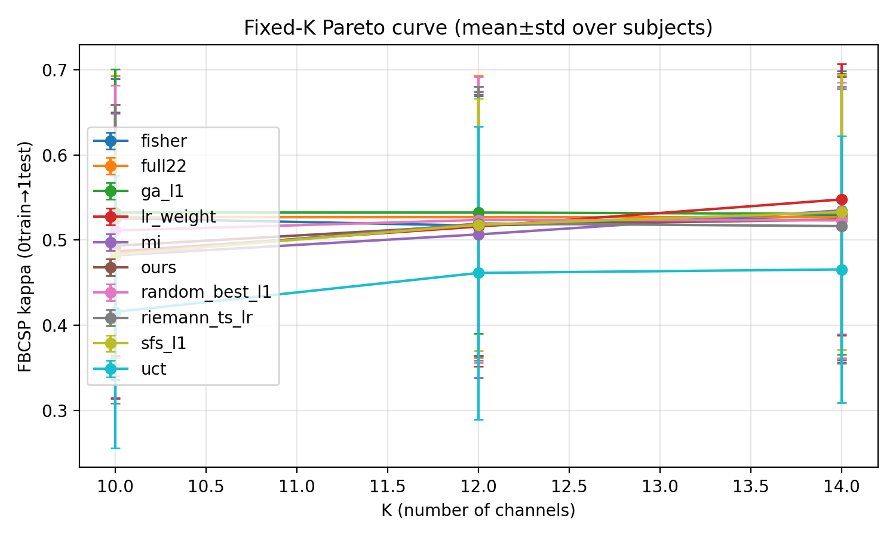
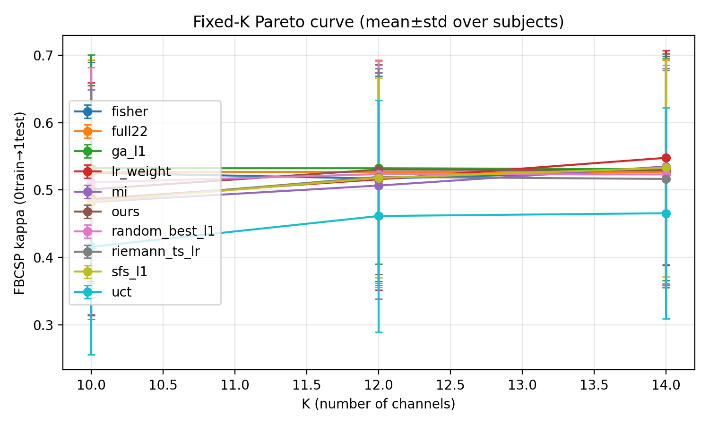
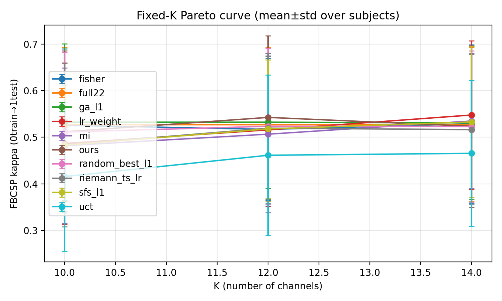
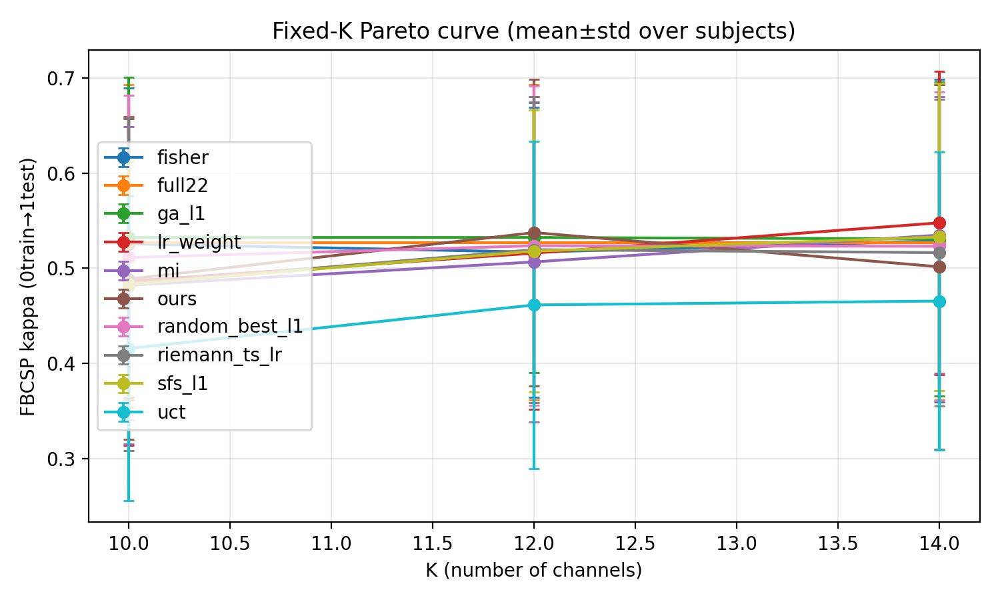
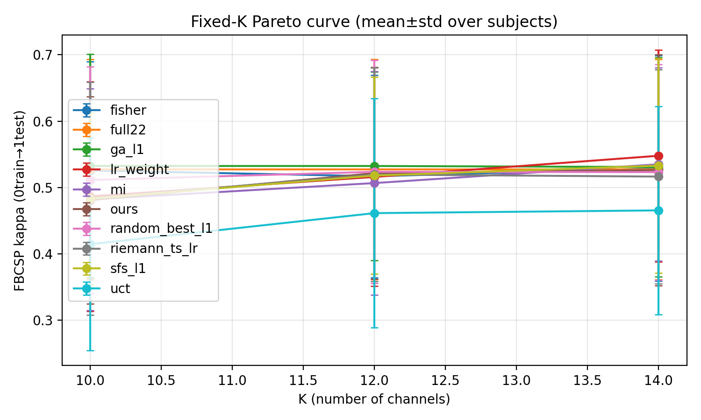

# Post-mortem — EEG-only + Arena Gate — K=10/12/14 Parallel Ablations (all 9 subjects) — best_frozen — 2026-01-18

## 1) Setting (main-result protocol)
- Dataset: BNCI2014_001 (BCI-IV 2a), 4-class MI, subjects=1–9
- Protocol: **0train used for training & selection; 1test labels only for reporting**
- Main-result constraint: **pure EEG** (`data.include_eog=false`, `data.use_eog_regression=false`)
- Evaluator: L1 FBCSP (`robust_mode=q20`) + reward normalization `adv_lrmax`
- Metrics: Cohen’s kappa + accuracy (mean across subjects; also track per-subject win/tie/lose vs `full22`)
- Hardware: CPU-only; self-play uses **process backend** (see `train_agent_teacher_fast_think2_q20_adv_lrmax_eegonly_arena.yaml`)

## 2) What was evaluated (5 one-lever training runs)
All 5 runs share the same base (EEG-only + arena accept/reject) and differ by exactly one primary lever:

|Run (out_dir)|One lever (vs base)|Train preset|
|---|---|---|
|`runs/agent_bd_teacher_fast_think2_q20_adv_lrmax_eegonly_arena_k10_12_14`|Focus training tasks on `K∈{10,12,14}`|`eeg_channel_game/configs/exp/train_agent_teacher_fast_think2_q20_adv_lrmax_eegonly_arena_k10_12_14.yaml`|
|`runs/agent_bd_teacher_fast_think2_q20_adv_lrmax_eegonly_arena_k12_weighted`|Bias training sampling toward **K=12**|`eeg_channel_game/configs/exp/train_agent_teacher_fast_think2_q20_adv_lrmax_eegonly_arena_k12_weighted.yaml`|
|`runs/agent_bd_teacher_fast_think2_q20_adv_lrmax_eegonly_arena_leaf_warmup200`|Slower leaf bootstrap handoff (`warmup_iters=200`)|`eeg_channel_game/configs/exp/train_agent_teacher_fast_think2_q20_adv_lrmax_eegonly_arena_leaf_warmup200.yaml`|
|`runs/agent_bd_teacher_fast_think2_q20_adv_lrmax_eegonly_arena_gate052`|Looser arena gate threshold (`win_rate_threshold=0.52`)|`eeg_channel_game/configs/exp/train_agent_teacher_fast_think2_q20_adv_lrmax_eegonly_arena_gate052.yaml`|
|`runs/agent_bd_teacher_fast_think2_q20_adv_lrmax_eegonly_arena_ds_eta0p2_k10_12_14`|Stronger domain-shift penalty (`eta=0.2`)|`eeg_channel_game/configs/exp/train_agent_teacher_fast_think2_q20_adv_lrmax_eegonly_arena_ds_eta0p2_k10_12_14.yaml`|

## 3) Critical reproducibility: freeze `best.pt` before eval
Training continued while evaluation was running, so `runs/.../checkpoints/best.pt` is a moving target.

We froze the best checkpoint in each run (same timestamp label) and evaluated the frozen file:
- Frozen checkpoint name: `checkpoints/best_frozen_20260117_203150.pt`
- Evaluation tag (shared across runs): `eval_best_frozen_20260117_203150_stochR10_nsim1024_k10_12_14_all9`
- For strict reproducibility, `run_pareto_curve.py` also snapshots the *loaded* checkpoint into the tag dir:
  - Example: `.../pareto/<tag>/ours_checkpoint_iter136.pt` (exact iter differs per run)

Checkpoint iters used in this eval (from each run’s `pareto/<tag>/run_config.json`):
|Run|Frozen checkpoint iter|
|---|---:|
|`..._k10_12_14`|82|
|`..._k12_weighted`|197|
|`..._leaf_warmup200`|136|
|`..._gate052`|82|
|`..._ds_eta0p2_k10_12_14`|191|

## 4) Evaluation configuration (shared)
Eval preset:
- `eeg_channel_game/configs/exp/eval_pareto_agent_teacher_fast_think2_q20_adv_lrmax_best_eegonly_k10_12_14.yaml`

Search budget (ours):
- `mcts.n_sim=1024`
- `--ours-stochastic --ours-tau 0.8 --ours-restarts 10`

Baselines included:
- `ours, uct, fisher, mi, lr_weight, riemann_ts_lr, sfs_l1, random_best_l1, ga_l1, full22`

Notes:
- `--baseline-cache none` was used to avoid parallel write conflicts when running 5 evals at once.

## 5) Results summary (mean across 9 subjects; kappa)
Baseline reference (same across runs for this variant/config):
- `full22`: **0.5273** (K=10/12/14)
- `ga_l1`: **0.5324** (K=10), **0.5324** (K=12), **0.5309** (K=14)
- `lr_weight`: **0.4866** (K=10), **0.5159** (K=12), **0.5478** (K=14)

### 5.1 Ours vs full22 (kappa_mean)
|Run|K=10|Δ vs full22|K=12|Δ vs full22|K=14|Δ vs full22|
|---|---:|---:|---:|---:|---:|---:|
|`..._k10_12_14`|0.4933|-0.0340|0.5175|-0.0098|0.5242|-0.0031|
|`..._k12_weighted`|0.5010|-0.0262|0.5303|+0.0031|0.5293|+0.0021|
|`..._leaf_warmup200`|0.5118|-0.0154|0.5427|+0.0154|0.5237|-0.0036|
|`..._gate052`|0.4887|-0.0386|0.5376|+0.0103|0.5015|-0.0257|
|`..._ds_eta0p2_k10_12_14`|0.4810|-0.0463|0.5216|-0.0057|0.5262|-0.0010|

**Key observation**
- Even with heavy search (`n_sim=1024`, `restarts=10`), **K=10 is consistently below full22 in all 5 runs** → this is not explained by “insufficient search budget” alone.
- `leaf_warmup200` is the strongest overall (best K=12, and closest to full22 at K=10).

### 5.2 Win/tie/lose vs full22 (per-subject kappa)
Counted across 9 subjects, for each K: compare `ours` vs `full22` kappa.

|Run|K=10 (W/T/L)|K=12 (W/T/L)|K=14 (W/T/L)|
|---|---:|---:|---:|
|`..._k10_12_14`|3/0/6|4/1/4|5/0/4|
|`..._k12_weighted`|2/0/7|4/1/4|6/0/3|
|`..._leaf_warmup200`|5/0/4|5/0/4|5/0/4|
|`..._gate052`|2/0/7|4/1/4|4/0/5|
|`..._ds_eta0p2_k10_12_14`|2/0/7|4/0/5|4/0/5|

Interpretation:
- The mean gap at K=10 is dominated by a few strongly negative subjects (tail-risk problem).

## 6) Channel-subset behavior (are they selecting “the same channels”?)
We checked `sel_idx` in each run’s `pareto_by_subject.csv`.

### 6.1 Within each run: do subjects collapse to one subset?
No.
- For each run and each K∈{10,12,14}, `ours` produces **9 unique subsets for 9 subjects** (9/9 unique; no duplicated `sel_idx` across subjects).

### 6.2 Across runs: is each subject selecting the same subset?
Mixed.
- For K=10, most subjects have **different subsets across the 5 runs** (e.g., s01/s08 are 5/5 unique across runs).
- Some subjects have a stable “core” subset across runs (high overlap), e.g. mean Jaccard (K=10, across the 5 runs):
  - s03: **0.750**, s04: **0.638**, s06: **0.590** (more stable)
  - s01: **0.336**, s02: **0.348**, s09: **0.343** (less stable)

**Important nuance:** s03 has high cross-run stability but still performs poorly at K=10 → this suggests “stable but suboptimal subset” rather than pure search noise.

## 7) Failure-first diagnosis (what this eval tells us)
1) **Primary failure mode is K=10 robustness under subject heterogeneity** (hard subjects pull the mean down).
2) **Search budget is not the bottleneck** (already `n_sim=1024` + stochastic + 10 restarts; GA can still beat full22 at K=10).
3) **Leaf bootstrap schedule matters**:
   - `leaf_warmup200` improves both K=10 and K=12 (relative to other runs), consistent with the hypothesis that “value takeover too early hurts guidance/stability”.
4) **Stronger domain shift penalty (eta=0.2) is not helping here** (K=10 degrades most).

## 8) Figures (copied for paper/report reproducibility)
All plots are from each run’s own evaluation directory (same tag), copied into git:
- Folder: `docs/reports/figures/2026-01-18_eval_best_frozen_20260117_203150_k10_12_14_all9_5runs/`

Kappa plots:











(Accuracy plots are in the same folder with suffix `_pareto_acc.png`.)

## 9) Repro commands (template)
Freeze + evaluate one run:
```bash
ts=20260117_203150
run_dir=runs/agent_bd_teacher_fast_think2_q20_adv_lrmax_eegonly_arena_leaf_warmup200

cp -p ${run_dir}/checkpoints/best.pt ${run_dir}/checkpoints/best_frozen_${ts}.pt

PYTHONPATH=\"$PWD/.vendor\" MPLCONFIGDIR=\"$PWD/eeg_channel_game/data/mpl_cache\" \\
conda run -n rl --no-capture-output python3 -m eeg_channel_game.run_pareto_curve \\
  --config eeg_channel_game/configs/exp/eval_pareto_agent_teacher_fast_think2_q20_adv_lrmax_best_eegonly_k10_12_14.yaml \\
  --override project.device=cpu \\
  --override project.out_dir=${run_dir} \\
  --override mcts.n_sim=1024 \\
  --checkpoint ${run_dir}/checkpoints/best_frozen_${ts}.pt \\
  --tag eval_best_frozen_${ts}_stochR10_nsim1024_k10_12_14_all9 \\
  --subjects 1,2,3,4,5,6,7,8,9 \\
  --k 10,12,14 \\
  --methods ours,uct,fisher,mi,lr_weight,riemann_ts_lr,sfs_l1,random_best_l1,ga_l1,full22 \\
  --ours-stochastic --ours-tau 0.8 --ours-restarts 10 \\
  --baseline-cache none \\
  --resume --plot
```

## 10) Commands actually used in this 5-run evaluation batch
We froze `best.pt` for each run and then launched the 5 evals in parallel (background).

```bash
ts=20260117_203150

runs=(
  agent_bd_teacher_fast_think2_q20_adv_lrmax_eegonly_arena_k10_12_14
  agent_bd_teacher_fast_think2_q20_adv_lrmax_eegonly_arena_k12_weighted
  agent_bd_teacher_fast_think2_q20_adv_lrmax_eegonly_arena_leaf_warmup200
  agent_bd_teacher_fast_think2_q20_adv_lrmax_eegonly_arena_gate052
  agent_bd_teacher_fast_think2_q20_adv_lrmax_eegonly_arena_ds_eta0p2_k10_12_14
)

for r in "${runs[@]}"; do
  cp -p "runs/${r}/checkpoints/best.pt" "runs/${r}/checkpoints/best_frozen_${ts}.pt"
done

for r in "${runs[@]}"; do
  extra_overrides=()
  if [[ "${r}" == "agent_bd_teacher_fast_think2_q20_adv_lrmax_eegonly_arena_ds_eta0p2_k10_12_14" ]]; then
    extra_overrides+=( "--override" "reward.domain_shift.eta=0.2" )
  fi

  PYTHONPATH="$PWD/.vendor" \
  MPLCONFIGDIR="$PWD/eeg_channel_game/data/mpl_cache" \
  OMP_NUM_THREADS=1 MKL_NUM_THREADS=1 OPENBLAS_NUM_THREADS=1 NUMEXPR_NUM_THREADS=1 \
  nohup conda run -n rl --no-capture-output python3 -m eeg_channel_game.run_pareto_curve \
    --config eeg_channel_game/configs/exp/eval_pareto_agent_teacher_fast_think2_q20_adv_lrmax_best_eegonly_k10_12_14.yaml \
    --override project.device=cpu \
    --override project.out_dir="runs/${r}" \
    --override mcts.n_sim=1024 \
    "${extra_overrides[@]}" \
    --checkpoint "runs/${r}/checkpoints/best_frozen_${ts}.pt" \
    --tag "eval_best_frozen_${ts}_stochR10_nsim1024_k10_12_14_all9" \
    --subjects 1,2,3,4,5,6,7,8,9 \
    --k 10,12,14 \
    --methods ours,uct,fisher,mi,lr_weight,riemann_ts_lr,sfs_l1,random_best_l1,ga_l1,full22 \
    --ours-stochastic --ours-tau 0.8 --ours-restarts 10 \
    --plot --resume \
    --baseline-cache none \
    >> "runs/eval_${r}_${ts}.log" 2>&1 &
  echo $! > "runs/eval_${r}_${ts}.pid"
done
```

