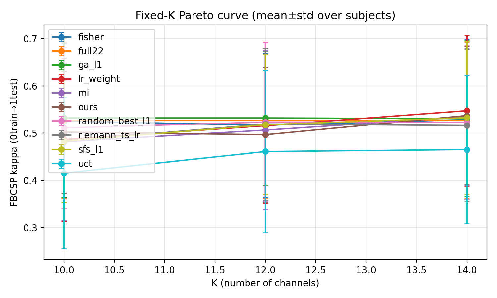
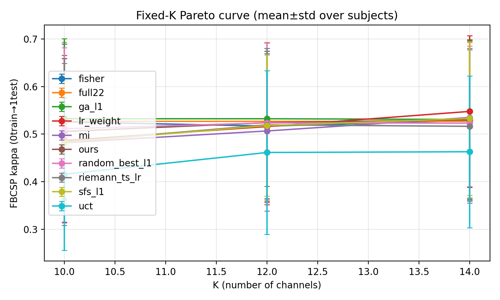

# Post-mortem — EEG-only + Arena Gate — LeafWarmup200 Ablations (dsOFF / no-teacherKL) + Channel Diff @ K=10 — 2026-01-22

## 0) Setting (main-result protocol; no leakage)
- Dataset: BNCI2014_001 (BCI-IV 2a), 4-class MI, subjects=1–9
- Protocol: **0train used for training & selection; 1test labels only for reporting**
- Main-result constraint: **pure EEG** (`data.include_eog=false`, `data.use_eog_regression=false`)
- Evaluator: L1 FBCSP (`robust_mode=q20`) + reward normalization `adv_lrmax`
- Evaluation: **heavy search** `mcts.n_sim=1024` + `--ours-stochastic --ours-tau 0.8 --ours-restarts 10`
- K set: `K ∈ {10,12,14}`

This report extends `docs/reports/2026-01-18_postmortem_eegonly_arena_k10_12_14_parallel_ablation_best_frozen.md` with two follow-up ablations and a concrete “what channels are missed?” diff analysis for hard subjects.

## 1) What was evaluated (2 one-lever follow-up runs)
All runs inherit the base: `train_agent_teacher_fast_think2_q20_adv_lrmax_eegonly_arena_leaf_warmup200.yaml`.

|Run (out_dir)|One lever|Training preset / override|
|---|---|---|
|`runs/agent_bd_teacher_fast_think2_q20_adv_lrmax_eegonly_arena_leaf_warmup200_dsOFF_20260118_213009`|Disable domain-shift penalty|eval override: `reward.domain_shift.enabled=false`|
|`runs/agent_bd_teacher_fast_think2_q20_adv_lrmax_eegonly_arena_leaf_warmup200_no_teacherkl_20260120_114559`|Disable lr_weight teacher KL|`eeg_channel_game/configs/exp/train_agent_teacher_fast_think2_q20_adv_lrmax_eegonly_arena_leaf_warmup200_no_teacherkl.yaml`|

## 2) Results summary (mean kappa across 9 subjects)
Reference baselines for this variant:
- `full22`: **0.5273** (K=10/12/14)
- `ga_l1`: **0.5324** (K=10), **0.5324** (K=12), **0.5309** (K=14)

### 2.1 Compare vs the best-known baseline run (LeafWarmup200 base)
From the earlier frozen evaluation of the base run:
- base run: `runs/agent_bd_teacher_fast_think2_q20_adv_lrmax_eegonly_arena_leaf_warmup200`
- tag: `eval_best_frozen_20260117_203150_stochR10_nsim1024_k10_12_14_all9`

|Run|K=10|Δ vs full22|K=12|Δ vs full22|K=14|Δ vs full22|
|---|---:|---:|---:|---:|---:|---:|
|LeafWarmup200 (base)|0.5118|-0.0154|0.5427|+0.0154|0.5237|-0.0036|
|LeafWarmup200 + dsOFF|0.5057|-0.0216|0.5242|-0.0031|0.5303|+0.0031|
|LeafWarmup200 + no-teacherKL|0.5026|-0.0247|0.4969|-0.0303|0.5376|+0.0103|

**Conclusions (from this table)**
1) `dsOFF` does **not** fix K=10 and degrades K=12 vs the base LeafWarmup200 run.
2) Removing **teacher KL alone** (no-teacherKL) makes K=10/K=12 worse, while K=14 improves a bit.
3) The “K=10 below full22” failure persists even with heavy search and across multiple checkpoints → not “search budget only”.

## 3) Concrete channel-set diffs: hard subjects @ K=10 (ours vs ga_l1)
Goal: make the diagnosis actionable (“should we change token/conditioning, or search, or reward?”) by checking **what GA keeps picking that ours keeps missing**.

We use the latest eval results (no-teacherKL run):
- eval dir: `runs/agent_bd_teacher_fast_think2_q20_adv_lrmax_eegonly_arena_leaf_warmup200_no_teacherkl_20260120_114559/pareto/eval_best_frozen_20260122_101317_noTeacherKL_stochR10_nsim1024_k10_12_14_all9`
- source: `pareto_by_subject.csv` (columns include `sel_idx` and `meta`)
- channel order (index → name) for this variant:
  - `[Fz, FC3, FC1, FCz, FC2, FC4, C5, C3, C1, Cz, C2, C4, C6, CP3, CP1, CPz, CP2, CP4, P1, Pz, P2, POz]`

### 3.1 Per-subject diff (K=10)
Notation: `missed = ga_l1 − ours` (channels GA selects but ours does not).

|Subject|ours (K=10)|ga_l1 (K=10)|missed (ga_l1 − ours)|
|---:|---|---|---|
|01|C1,C2,C4,C5,CP1,CP4,CPz,FC4,P1,Pz|C1,C2,C3,C4,C5,CP3,CPz,Cz,FC4,P1|**C3, CP3, Cz**|
|03|C3,C4,C5,CP3,CP4,CPz,Cz,FC2,FC4,FCz|C3,C4,CP1,CP2,CP3,CPz,FC2,FC3,FCz,P2|**CP1, CP2, FC3, P2**|
|06|C1,C2,C4,CP3,CP4,Cz,FC2,FC4,P1,POz|C1,C2,C3,CP1,CP2,Cz,FC1,P1,P2,POz|**C3, CP1, CP2, FC1, P2**|
|08|C1,C4,C5,C6,CP3,CP4,CPz,FC4,Fz,P2|C2,C5,C6,CP2,CP3,CP4,CPz,FC1,P1,Pz|**C2, CP2, FC1, P1, Pz**|

### 3.2 “Most consistently missed” channels (across these 4 subjects)
Count how often each channel is in `missed (ga_l1 − ours)`:
- **CP2: 3/4**
- **C3: 2/4**
- **CP1: 2/4**
- **FC1: 2/4**
- **P2: 2/4**

**Interpretation**
- For the hard subjects, `ours` tends to over-commit to **right-lateral** channels (e.g., `FC4/CP4`) while repeatedly missing **more central / contralateral / posterior** picks that GA finds useful (notably **CP2**, and sometimes **FC1/CP1/C3**).
- This pattern is consistent with the earlier LeafWarmup200 base run as well (CP4 over-selected; CP2/FC1/CP* missed on hard subjects).

## 4) Actionable next step (one-lever candidates)
Given the evidence above, the failure is better explained by **systematic guidance bias / lack of subject-conditional adaptation** than by “search depth not enough”.

Recommended next levers (pick ONE next):
1) **Subject-conditional modulation (FiLM)**: use a context vector (subject/session quality summary already exists) to scale/shift token embeddings or transformer blocks → let the same shared agent behave differently per subject.
2) **Baseline-mixture policy prior / teacher**: instead of a single lr_weight teacher, learn a context-dependent mixture over `{lr_weight, fisher, mi, riemann}` as a policy prior (and/or teacher KL).
3) **Single-agent MCTS value completion**: replace plain `Q=W/N` backup with a stabilized transform (e.g., “mixed value completion / qtransform” style) to reduce bias when reward estimates are noisy.

## 5) Figures (copied for reproducible reporting)
Folder in git:
- `docs/reports/figures/2026-01-22_eval_leaf_warmup200_ablation_k10_12_14_all9/`





## 6) Repro commands (as executed)
### 6.1 no-teacherKL eval
```bash
PYTHONPATH=\"$PWD/.vendor\" MPLCONFIGDIR=\"$PWD/eeg_channel_game/data/mpl_cache\" \\
conda run -n rl --no-capture-output python3 -m eeg_channel_game.run_pareto_curve \\
  --config eeg_channel_game/configs/exp/eval_pareto_agent_teacher_fast_think2_q20_adv_lrmax_best_eegonly_k10_12_14.yaml \\
  --override project.device=cpu \\
  --override project.out_dir=runs/agent_bd_teacher_fast_think2_q20_adv_lrmax_eegonly_arena_leaf_warmup200_no_teacherkl_20260120_114559 \\
  --override mcts.n_sim=1024 \\
  --checkpoint runs/agent_bd_teacher_fast_think2_q20_adv_lrmax_eegonly_arena_leaf_warmup200_no_teacherkl_20260120_114559/checkpoints/best_frozen_20260122_101317.pt \\
  --tag eval_best_frozen_20260122_101317_noTeacherKL_stochR10_nsim1024_k10_12_14_all9 \\
  --subjects 1,2,3,4,5,6,7,8,9 \\
  --k 10,12,14 \\
  --methods ours,uct,fisher,mi,lr_weight,riemann_ts_lr,sfs_l1,random_best_l1,ga_l1,full22 \\
  --ours-stochastic --ours-tau 0.8 --ours-restarts 10 \\
  --baseline-cache auto --resume --plot
```

### 6.2 dsOFF eval
```bash
PYTHONPATH=\"$PWD/.vendor\" MPLCONFIGDIR=\"$PWD/eeg_channel_game/data/mpl_cache\" \\
conda run -n rl --no-capture-output python3 -m eeg_channel_game.run_pareto_curve \\
  --config eeg_channel_game/configs/exp/eval_pareto_agent_teacher_fast_think2_q20_adv_lrmax_best_eegonly_k10_12_14.yaml \\
  --override project.device=cpu \\
  --override project.out_dir=runs/agent_bd_teacher_fast_think2_q20_adv_lrmax_eegonly_arena_leaf_warmup200_dsOFF_20260118_213009 \\
  --override reward.domain_shift.enabled=false \\
  --override mcts.n_sim=1024 \\
  --checkpoint runs/agent_bd_teacher_fast_think2_q20_adv_lrmax_eegonly_arena_leaf_warmup200_dsOFF_20260118_213009/checkpoints/best_frozen_.pt \\
  --tag eval_best_frozen__dsOFF_stochR10_nsim1024_k10_12_14_all9 \\
  --ours-stochastic --ours-tau 0.8 --ours-restarts 10 \\
  --baseline-cache auto --resume --plot
```

