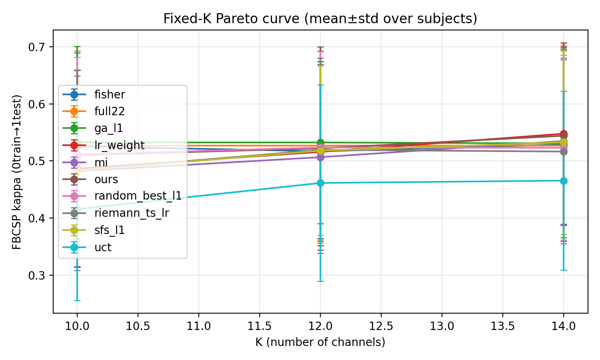
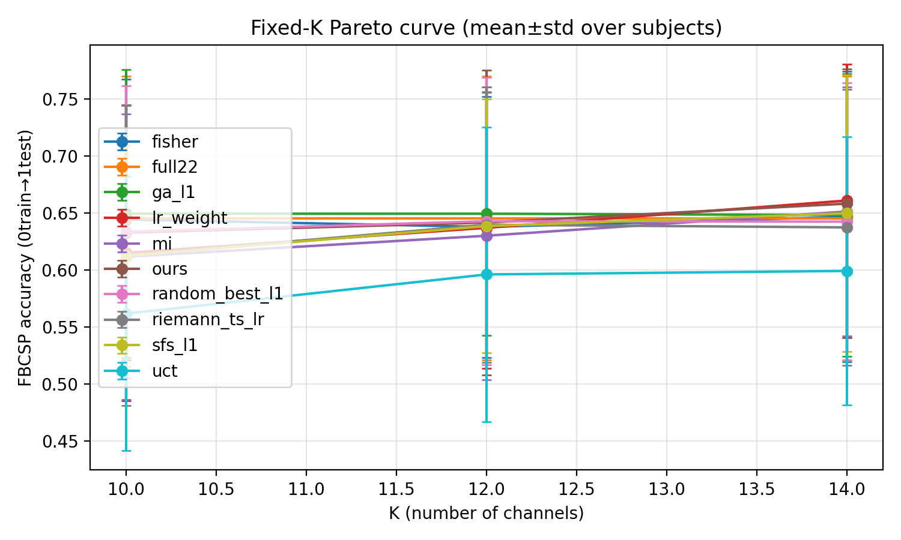
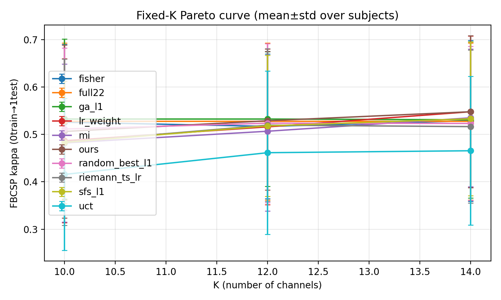
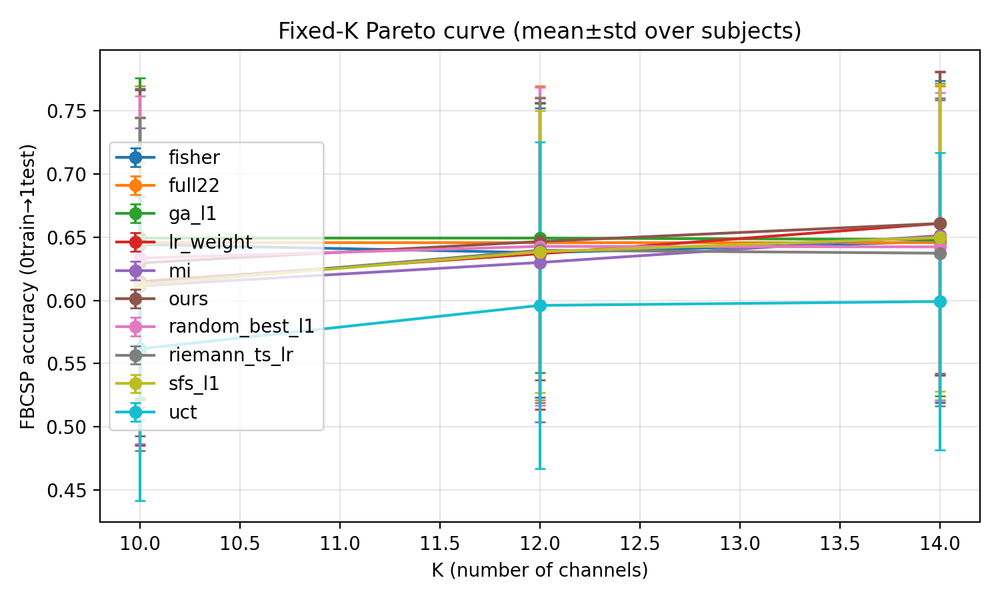

# Post-mortem — FiLM + CPU-opt + worst-K best checkpoint — K=10/12/14 (All9) — 2026-01-29

## 0) Setting (main-result protocol; no leakage)
- Dataset: BNCI2014_001 (BCI-IV 2a), 4-class MI, subjects=1–9
- Protocol: **0train used for training & selection; 1test labels only for reporting**
- Main-result constraint: **pure EEG** (`data.include_eog=false`, `data.use_eog_regression=false`)
- Evaluator: L1 FBCSP + reward normalization `adv_lrmax`
- K set: `K ∈ {10,12,14}` (exact-budget, mixed-K training)
- Evaluation (heavy search): `mcts.n_sim=1024` + `--ours-stochastic --ours-tau 0.8 --ours-restarts 10`

## 1) Motivation & code changes (why this run exists)
Observed issue in earlier runs: selecting `best.pt` by a single scalar (e.g., `mean_reward`) can hide **K trade-offs** (e.g., improves K=14 while regressing K=10/12).

This experiment series introduced:
1) **Best checkpoint metric = worst-K reward** during training (`train.checkpoint.best_metric=worst_k_mean_reward`) to make “multi-K robustness” explicit.
2) **CPU-only throughput fixes**: set PyTorch thread knobs for training, and add a **subprocess self-play backend** to avoid `multiprocessing.SemLock` failures on some CPU servers.
3) **FiLM evaluation correctness**: ensure eval/search scripts instantiate the net with FiLM enabled when required by config/checkpoint.

Relevant code commits:
- `19166b8` (Train: CPU-opt + subprocess self-play + worst-K best metric)
- `a54c561` (Eval: respect FiLM config + add preset)

## 2) Run under test
- out_dir: `runs/agent_bd_teacher_fast_think2_q20_adv_lrmax_eegonly_arena_leaf_warmup200_film_20260123_131855`
- training config: `eeg_channel_game/configs/exp/train_agent_teacher_fast_think2_q20_adv_lrmax_eegonly_arena_leaf_warmup200_film_cpuopt.yaml`
- eval preset: `eeg_channel_game/configs/exp/eval_pareto_agent_teacher_fast_think2_q20_adv_lrmax_eegonly_arena_leaf_warmup200_film_best_k10_12_14.yaml`

## 3) Results summary (mean kappa across 9 subjects)
Reference baselines for this EEG-only variant:
- `full22`: **0.5273** (K=10/12/14)
- `ga_l1`: **0.5324** (K=10), **0.5324** (K=12), **0.5309** (K=14)

We evaluated two frozen `best` checkpoints from the same run (heavy search, all9, K=10/12/14):
- `iter=525` tag: `eval_best_iter525_20260128_130758_film_stochR10_nsim1024_k10_12_14_all9`
- `iter=534` tag: `eval_best_iter534_20260129_093622_film_stochR10_nsim1024_k10_12_14_all9`

|Checkpoint|K=10 (ours)|Δ vs full22|K=12 (ours)|Δ vs full22|K=14 (ours)|Δ vs full22|
|---|---:|---:|---:|---:|---:|---:|
|best@iter525|0.5103|-0.0170|0.5221|-0.0051|0.5442|+0.0170|
|best@iter534|0.5062|-0.0211|0.5288|+0.0015|0.5478|+0.0206|

**Takeaway (for the paper target K=10–14)**: K=14 is consistently above `full22`, K=12 is ~tied, but K=10 remains below `full22` and `ga_l1` → the “K=10 hard” failure persists.

## 4) Artifacts (figures copied into git for reproducible reporting)
Folder in git:
- `docs/reports/figures/2026-01-29_eval_film_worstk_best_iter525_534_k10_12_14_all9/`

### 4.1 iter=525



### 4.2 iter=534



## 5) Repro commands (as executed)
### 5.1 eval best@iter525
```bash
/home/wjx/workspace/RL/ALPHA/eeg_channel_game/run_pareto_curve.py \
  --config eeg_channel_game/configs/exp/eval_pareto_agent_teacher_fast_think2_q20_adv_lrmax_eegonly_arena_leaf_warmup200_film_best_k10_12_14.yaml \
  --override project.out_dir=runs/agent_bd_teacher_fast_think2_q20_adv_lrmax_eegonly_arena_leaf_warmup200_film_20260123_131855 \
  --override project.device=cpu \
  --override mcts.n_sim=1024 \
  --checkpoint runs/agent_bd_teacher_fast_think2_q20_adv_lrmax_eegonly_arena_leaf_warmup200_film_20260123_131855/checkpoints/best_frozen_eval_best_iter525_20260128_130706_film_stochR10_nsim1024_k10_12_14_all9.pt \
  --tag eval_best_iter525_20260128_130758_film_stochR10_nsim1024_k10_12_14_all9 \
  --ours-restarts 10 --ours-stochastic --ours-tau 0.8 \
  --plot
```

### 5.2 eval best@iter534
```bash
/home/wjx/workspace/RL/ALPHA/eeg_channel_game/run_pareto_curve.py \
  --config eeg_channel_game/configs/exp/eval_pareto_agent_teacher_fast_think2_q20_adv_lrmax_eegonly_arena_leaf_warmup200_film_best_k10_12_14.yaml \
  --override project.out_dir=runs/agent_bd_teacher_fast_think2_q20_adv_lrmax_eegonly_arena_leaf_warmup200_film_20260123_131855 \
  --override project.device=cpu \
  --override mcts.n_sim=1024 \
  --checkpoint runs/agent_bd_teacher_fast_think2_q20_adv_lrmax_eegonly_arena_leaf_warmup200_film_20260123_131855/checkpoints/best_frozen_eval_best_iter534_20260129_093622_film_stochR10_nsim1024_k10_12_14_all9.pt \
  --tag eval_best_iter534_20260129_093622_film_stochR10_nsim1024_k10_12_14_all9 \
  --ours-restarts 10 --ours-stochastic --ours-tau 0.8 \
  --plot
```

