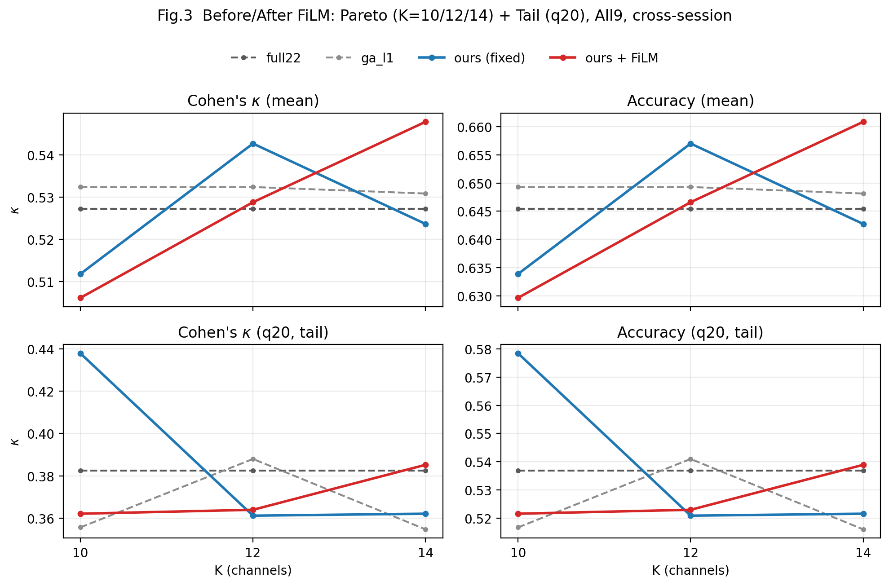

# Report — From Fixed EEG Tokens to FiLM-Conditioned Tokens (RL Input Modulation) — 2026-01-29

## 0) Problem setting (protocol & constraints)
- Dataset: BNCI2014_001 (BCI-IV 2a), 4-class MI, subjects=1–9.
- Protocol: **0train used for training & channel selection; 1test labels only for final reporting** (no leakage).
- Main-result constraint: **EEG-only** (`data.include_eog=false`, `data.use_eog_regression=false`).
- Evaluation style: fixed-K Pareto (`K=10/12/14`) with **heavy search** (`mcts.n_sim=1024`, stochastic restarts).

This note documents: how we diagnosed “train reward ↑ but cross-session test ↓/flat”, why the original (fixed) EEG token features were insufficient, and how we introduced a FiLM-style conditioning mechanism to make the *effective* RL input representation subject-aware.

---

## 1)发现问题：训练奖励上升，但跨 session 测试不升反降（Fig.1）
我们在多次 RL 训练中观察到一个一致现象：**训练阶段的 mean reward 可以持续上升/维持高位**，但在严格 0train→1test 的评测上（尤其是小预算 K，如 K=10）性能不随之提升，甚至出现倒退。

这通常意味着：模型正在“变得更会优化训练 reward”，但这种优化 **没有转化为跨 session 的泛化收益**。结合被试间异质性（某些 baseline 在少数被试上极强）以及通道选择任务本身的单人组合优化属性，我们将问题聚焦到：**“固定特征 + 共享 agent”在被试条件变化下缺乏自适应能力**。

---

## 2)定位问题：固定 token 表达对“被试差异/域偏移”不够条件化
在本项目中，RL 的状态输入为 token 序列（`tokens: [B, 24, d_in]`），其中包含：
- `22` 个 **channel token**（每个通道的统计/质量/可分性等特征）；
- `1` 个 `CLS` token；
- `1` 个 `CTX` token（全局上下文：被试/折的统计摘要）。

在 FiLM 之前，网络对这些 token 的处理是“**同一套参数同一套映射**”，即：
- token 的原始特征是固定的；
- 网络对不同被试/折的 token 重要性“**只能隐式地**”在参数里平均化吸收；
导致容易出现：对某些被试/某些 K 有效，但对另一部分被试/小预算 K 失效（典型表现为 K=10 持续落后 full22/GA）。

---

## 3)解决方法：FiLM 风格的“上下文调制”让输入表示可条件化（Fig.2）
我们采用了 FiLM（Feature-wise Linear Modulation）式的条件化机制：使用 `CTX token` 生成调制参数，对所有 token embedding 做按维缩放/平移。

### 3.1 结构（与实现一致）
在 `PolicyValueNet` 中（`eeg_channel_game/model/policy_value_net.py`）：
- 取 `CTX`（最后一个 token，index=23）的原始特征 `c = tokens[:, 23, :] ∈ R^{d_in}`；
- 通过一个小 MLP 输出 `γ(c), β(c) ∈ R^{d_model}`；
- 对所有 token 的 embedding 做调制：
  \[
  x' = x \odot (1 + \gamma(c)) + \beta(c)
  \]
  其中 `x = in_proj(tokens)` 是线性投影后的 token embedding。

### 3.2 工程细节（有助于稳定训练）
- FiLM 的最后一层线性层权重/偏置初始化为 `0`，保证一开始是“近似恒等映射”，避免一上来就强行改变表示导致训练不稳。
- 该 conditioning 不引入任何 1test 标签信息：`CTX` 来自 0train 的 fold/stat 摘要，符合 “0train-only 训练/选择；1test 仅报告” 的硬约束。

---

## 4)结果对比：FiLM 后跨 session 更稳健（尤其在较大预算 K）（Fig.3）
我们用统一评测协议（all9、K=10/12/14、`mcts.n_sim=1024`、`--ours-stochastic --ours-restarts 10 --ours-tau 0.8`）对比了：
- **Before（fixed）**：不启用 FiLM 的 LeafWarmup200 基线 run
- **After（FiLM）**：启用 FiLM 的 run（best@iter534）

图 3 同时给出 **Pareto（mean）** 与 **尾部风险（q20）** 的 before/after 对比版面：

### 4.1 关键结论（从 Fig.3 与 CSV 汇总）
- **K=14 显著改善（mean 与 q20 均提升）**：FiLM 能更好地利用上下文调制，在较大通道预算下获得更稳健的跨 session 泛化。
- **K=12 的方差降低/尾部略有改善，但 mean 有波动**：提示 FiLM 带来“稳定性收益”，但训练目标与选 best 的准则仍需对齐（多 K/风险敏感）。
- **K=10 仍是主要短板**：FiLM 并未自动解决小预算下的困难被试问题；这表明还需要进一步的“条件化 + 先验/搜索/奖励”协同设计。

---

## 5)下一步工作（为 TBME/JBHI 的“强证据链”补齐）
为了让 **K=10–14** 都稳定超过 `full22`（且 tail/q20 不掉队），下一步建议按 one-lever 原则推进：
1) **条件化的 baseline-mixture prior / teacher**：让模型学习“给定 CTX，应该更信 lr_weight/MI/Fisher/Riemann 中的哪一个”，替代单一 teacher，提升被试自适应。
2) **训练目标对齐多-K 与风险敏感**：继续使用 `worst-K` 作为 checkpoint 选择准则，并考虑将 `q20`（或 LCB）纳入训练过程的监控/门控指标，避免“均值好看但尾部差”。
3) **面向 K=10 的定向诊断**：结合“ours vs ga_l1 的通道差分”，把持续漏选的关键通道（如 CP2/FC1/CP1 等）映射回 token/先验/搜索偏置来源，形成可检验的最小改动方案与消融矩阵。

